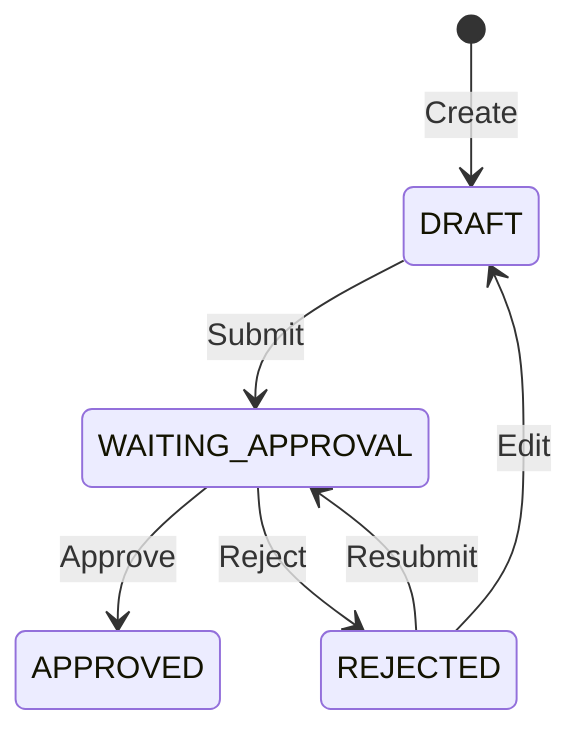
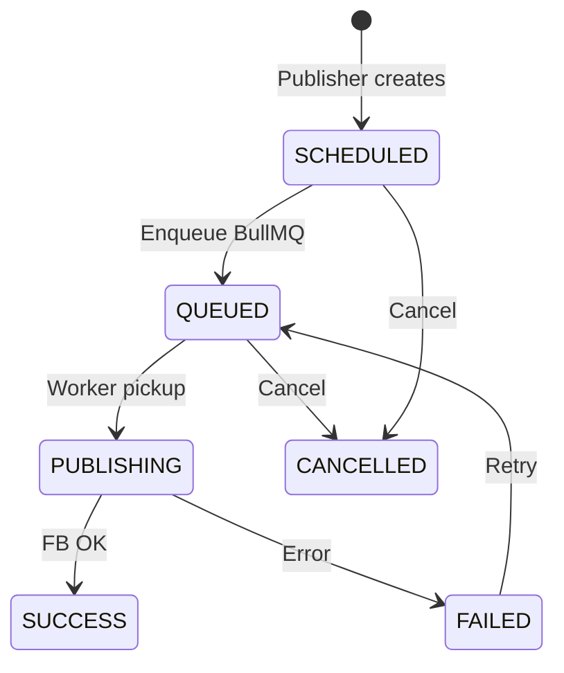

# 02 — Architecture

> Kiến trúc chi tiết cho triển khai coding v2.0

---

## 1. System Context

```text
┌─────────────────────────────────────────────────────────────────┐
│              Social Content Workflow Platform                    │
│                                                                  │
│  ┌──────────┐    ┌──────────┐    ┌──────────┐    ┌──────────┐  │
│  │ Frontend │───▶│   API    │───▶│ Postgres │    │  Redis   │  │
│  │  React   │    │  NestJS  │    └──────────┘    └────┬─────┘  │
│  └──────────┘    └────┬─────┘                        │        │
│                        │         ┌──────────┐         │        │
│                        └────────▶│  Worker  │◀────────┘        │
│                                  │  NestJS  │                   │
│                                  └────┬─────┘                   │
└───────────────────────────────────────┼──────────────────────────┘
                                        │
                    ┌───────────────────┼───────────────────┐
                    ▼                   ▼                   ▼
              Google Drive        Meta Graph API         (no Sheet)
```

---

## 2. Layered Architecture (Backend)

```text
┌─────────────────────────────────────────┐
│  Presentation Layer                      │
│  Controllers, DTOs, Swagger, Guards      │
├─────────────────────────────────────────┤
│  Application Layer                       │
│  Services (use cases), Scheduler         │
├─────────────────────────────────────────┤
│  Domain Layer                            │
│  Entities, Enums, Domain errors          │
├─────────────────────────────────────────┤
│  Infrastructure Layer                    │
│  Prisma repos, BullMQ, Google Drive, FB  │
└─────────────────────────────────────────┘
```

### Quy tắc phụ thuộc

- Controller → Service → Repository → Prisma
- Không import Prisma trong Controller
- External API (Google Drive, Meta) wrap trong adapter/infra service
- Clean Architecture + DDD-lite + feature-first module

---

## 3. Module Map (NestJS)

| Module | Responsibility | Depends on |
|--------|----------------|------------|
| `AuthModule` | Login, refresh, JWT | UsersModule |
| `UsersModule` | User CRUD | Prisma, AuditLogs |
| `RolesModule` | Role/permission lookup | Prisma |
| `FacebookPagesModule` | Page CRUD, token crypto | Prisma, AuditLogs |
| `ContentAssetsModule` | Content CRUD, submit review | Prisma, GoogleDrive, AuditLogs |
| `ReviewsModule` | Approve, reject workflow | ContentAssets, Comments, AuditLogs |
| `CommentsModule` | Review comments | Prisma |
| `GoogleDriveModule` | Upload, stream, thumbnail | Google API |
| `PublishJobsModule` | CRUD jobs, cancel, retry | Prisma, BullMQ, AuditLogs |
| `AuditLogsModule` | Write/read audit | Prisma |
| `DashboardModule` | Aggregations | Prisma |
| `HealthModule` | `/health`, readiness | Prisma, Redis |

**Worker app modules:**

| Module | Responsibility |
|--------|----------------|
| `PublishProcessorModule` | `@Processor('publish-facebook')` |
| `FacebookPublisherModule` | Graph API client |
| `MediaStreamModule` | Stream từ Google Drive (không lưu disk) |

---

## 4. Workspace Separation (Frontend)

```text
Content Workspace          Publish Workspace
├── ContentLibrary         ├── PublisherCenter
│   upload, edit           │   approved list
│   submit review          │   caption, hashtag
└── (no schedule UI)       ├── ScheduleCalendar
                           ├── QueueMonitor
                           └── FailedJobs

Shared: Dashboard, Auth
Admin-only: Users, Pages, Audit, Settings
Reviewer-only: ReviewCenter
```

---

## 5. Request Flow Examples

### 5.1 Upload Media + Create Content

```text
POST /media/upload (multipart)
  → GoogleDriveService.upload(file)
  → Return { fileId, mimeType, size, thumbnailUrl }

POST /content
  → ContentAssetsService.create()
      1. Validate drive_file_id exists
      2. Insert content_assets (DRAFT)
      3. Audit log
```

### 5.2 Submit Review → Approve

```text
PATCH /content/:id/submit
  → status: DRAFT|REJECTED → WAITING_APPROVAL

POST /content/:id/approve (REVIEWER)
  → ReviewsService.approve()
      1. Validate status = WAITING_APPROVAL
      2. Update → APPROVED, set approved_by
      3. Audit log
```

### 5.3 Publisher Schedule

```text
POST /publish-jobs
  → PublishJobsService.create()
      1. Validate content status = APPROVED
      2. Validate page active
      3. Insert publish_jobs (SCHEDULED) + caption, hashtags
      4. BullMQ enqueue(delay = schedule_time - now)
      5. Update → QUEUED
      6. Audit log
```

### 5.4 Worker Publish (Stream)

```text
BullMQ job received
  → PublishFacebookProcessor.process()
      1. Load job + content + page (decrypt token)
      2. If CANCELLED/SUCCESS → skip (idempotent)
      3. Update → PUBLISHING
      4. GoogleDriveService.createReadStream(fileId)
      5. FacebookPublisher.publishStream(mediaType, stream, caption)
      6. Update → SUCCESS + facebook_post_id
      OR catch → FAILED + error_message (BullMQ retry)
```

Chi tiết Drive: [06-google-drive.md](./06-google-drive.md)  
Chi tiết FB: [07-facebook-publisher.md](./07-facebook-publisher.md)

---

## 6. Scheduler Design

**Khuyến nghị V1:** Enqueue ngay khi tạo job với `delay = schedule_time - now`

```typescript
const delayMs = Math.max(0, scheduleTime.getTime() - Date.now());
await queue.add('publish-facebook', { publishJobId }, { delay: delayMs, ... });
```

**Reconciliation cron** (mỗi 5 phút): scan jobs `SCHEDULED`/`QUEUED` quá hạn chưa vào queue → enqueue lại.

Chi tiết: [08-bullmq.md](./08-bullmq.md)

---

## 7. Cross-Cutting Concerns

### 7.1 Error Handling

| Layer | Strategy |
|-------|----------|
| Validation | 400 + field errors |
| Auth | 401 |
| RBAC | 403 |
| Not found | 404 |
| Business rule | 409 Conflict |
| Invalid status transition | 422 |
| External API | Wrap → domain error, log full response |

### 7.2 Logging (Pino)

```typescript
{
  correlationId,
  userId,
  contentId,
  publishJobId,
  action: 'PUBLISH_START',
  durationMs
}
```

### 7.3 Token Encryption

```text
encrypt(plaintext, TOKEN_ENCRYPTION_KEY) → iv:authTag:ciphertext (base64)
decrypt on worker only when publishing
API list pages: mask token (last 4 chars)
```

---

## 8. Frontend Architecture

```text
frontend/src/
├── api/
├── hooks/
├── contexts/AuthContext.tsx
├── routes/AppRoutes.tsx
├── pages/
│   ├── Dashboard/
│   ├── ContentLibrary/
│   ├── ReviewCenter/          # NEW
│   ├── PublisherCenter/       # NEW
│   ├── ScheduleCalendar/
│   ├── QueueMonitor/
│   ├── FailedJobs/
│   ├── PageManagement/
│   ├── UserManagement/
│   └── AuditLogs/
├── components/layout/
└── utils/permissions.ts
```

### Route Guard Matrix

| Route | ADMIN | CONTENT | REVIEWER | PUBLISHER |
|-------|-------|---------|----------|-----------|
| /dashboard | ✓ | ✓ | ✓ | ✓ |
| /content | ✓ | ✓ | read | - |
| /review | ✓ | - | ✓ | - |
| /publisher | ✓ | - | - | ✓ |
| /calendar | ✓ | - | read | ✓ |
| /queue | ✓ | - | - | ✓ |
| /pages | ✓ | - | - | - |
| /users | ✓ | - | - | - |
| /audit | ✓ | - | - | - |

Chi tiết: [05-rbac.md](./05-rbac.md)

---

## 9. Integration Boundaries

### Google Drive API v3

| Operation | API |
|-----------|-----|
| Upload | `files.create` (multipart) |
| Stream download | `files.get` + `alt=media` |
| Thumbnail | `files.get` thumbnailLink hoặc generate |

Adapter: `GoogleDriveClient` — [06-google-drive.md](./06-google-drive.md)

### Meta Graph API

Adapter: `FacebookGraphClient` — [07-facebook-publisher.md](./07-facebook-publisher.md)

- Base: `https://graph.facebook.com/{version}`
- Timeout: 120s (video upload)
- Retry: chỉ 5xx/network

---

## 10. Scalability (V1 → V2)

| Concern | V1 | Scale path |
|---------|-----|------------|
| API | 1 instance | Horizontal + LB |
| Worker | 1 instance | N workers, same queue |
| Redis | Single | Sentinel / Cluster |
| Media | Drive stream | Optional MinIO cache |
| DB | Single Postgres | Read replica (dashboard) |

---

## 11. State Diagrams

### Content Status



### Publish Job Status



---

## 12. Coding Checklist per Module

- [ ] `*.module.ts`
- [ ] `*.controller.ts` — thin, Swagger
- [ ] `*.service.ts` — business logic + unit tests
- [ ] `*.repository.ts` — Prisma queries
- [ ] `dto/*.dto.ts` — class-validator
- [ ] Guards + permission decorators
- [ ] Audit decorator trên mutation endpoints
