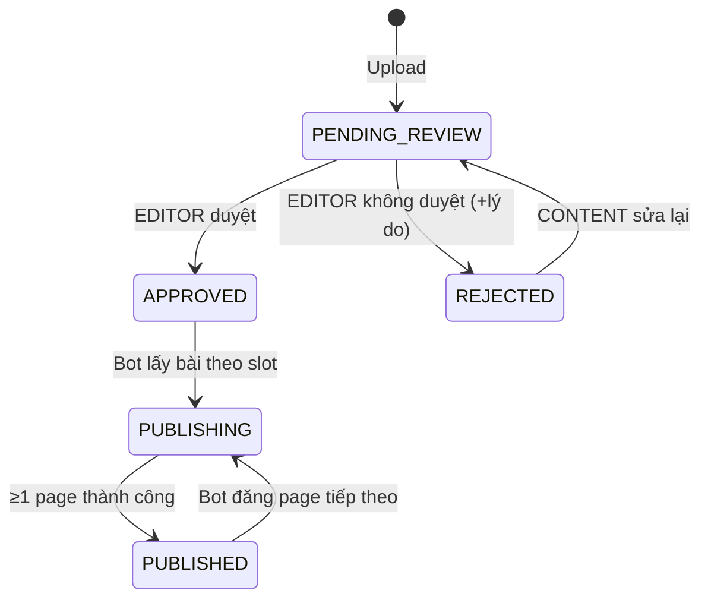
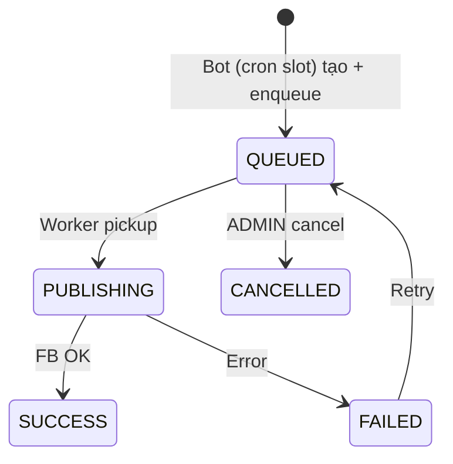

# 02 — Architecture

> Kiến trúc chi tiết cho triển khai coding — v3.0 (mô hình Auto-Post)

---

## 1. System Context

```text
┌─────────────────────────────────────────────────────────────────┐
│              Tool Auto FB — Luca                                 │
│                                                                  │
│  ┌──────────┐    ┌──────────┐    ┌──────────┐    ┌──────────┐  │
│  │ Frontend │───▶│   API    │───▶│ Postgres │    │  Redis   │  │
│  │  React   │    │  NestJS  │    └──────────┘    └────┬─────┘  │
│  └──────────┘    └────┬─────┘                        │        │
│                        │   ┌───────────────┐          │        │
│                        │   │ Cron Scheduler │──enqueue─┤        │
│                        │   │ (auto-post)    │          │        │
│                        │   └───────────────┘          │        │
│                        │         ┌──────────┐         │        │
│                        └────────▶│  Worker  │◀────────┘        │
│                                  │  NestJS  │                   │
│                                  └────┬─────┘                   │
└───────────────────────────────────────┼──────────────────────────┘
                                        │
                    ┌───────────────────┼───────────────────┐
                    ▼                   ▼                   ▼
              Google Drive        Meta Graph API         (no Sheet)
```

Khác biệt lớn so với v2.0: **không còn Publisher thao tác lên lịch từng bài**.
Một **Cron Scheduler** quét `auto_post_slots` và tự tạo publish jobs (Bot).

---

## 2. Layered Architecture (Backend)

```text
┌─────────────────────────────────────────┐
│  Presentation Layer                      │
│  Controllers, DTOs, Swagger, Guards      │
├─────────────────────────────────────────┤
│  Application Layer                       │
│  Services (use cases), AutoPost Scheduler│
├─────────────────────────────────────────┤
│  Domain Layer                            │
│  Entities, Enums, Domain errors          │
├─────────────────────────────────────────┤
│  Infrastructure Layer                    │
│  Prisma repos, BullMQ, Google Drive, FB  │
└─────────────────────────────────────────┘
```

### Quy tắc phụ thuộc

- Controller → Service → Repository → Prisma
- Không import Prisma trong Controller
- External API (Google Drive, Meta) wrap trong adapter/infra service
- Clean Architecture + DDD-lite + feature-first module

---

## 3. Module Map (NestJS)

| Module | Responsibility | Depends on |
|--------|----------------|------------|
| `AuthModule` | Login, refresh, JWT | UsersModule |
| `UsersModule` | User CRUD (3 role) | Prisma, AuditLogs |
| `FacebookPagesModule` | Page CRUD, token crypto | Prisma, AuditLogs |
| `ContentAssetsModule` | Content CRUD + duyệt qua PATCH, assignments | Prisma, GoogleDrive, AuditLogs |
| `AutoPostModule` | CRUD slots/config + **cron scheduler picker** | Prisma, PublishJobs, AuditLogs |
| `GoogleDriveModule` | Upload, stream, thumbnail | Google API |
| `PublishJobsModule` | Jobs (Bot tạo), cancel, retry, timeline | Prisma, BullMQ, AuditLogs |
| `AuditLogsModule` | Write/read audit | Prisma |
| `DashboardModule` | Aggregations (range, ADS, per-page) | Prisma |
| `HealthModule` | `/health`, readiness | Prisma, Redis |

Đã bỏ: `ReviewsModule`, `CommentsModule` (duyệt gộp vào ContentAssets qua PATCH,
lý do không duyệt lưu ở `reject_comment`).

**Worker app modules:**

| Module | Responsibility |
|--------|----------------|
| `PublishProcessorModule` | `@Processor('publish-facebook')` |
| `FacebookPublisherModule` | Graph API client |
| `MediaStreamModule` | Stream từ Google Drive (không lưu disk) |

---

## 4. Frontend Workspace (6 menu + Monitor)

```text
Menu chính (theo role)
├── Tổng quan (Dashboard)            All
├── Quản lý Ảnh/Video Edit           All (CONTENT: bài của mình)
│     upload, edit drawer, duyệt trạng thái, Đạt ADS, phân bổ page
├── Lịch đăng bài (Timeline)         ADMIN, EDITOR
├── Cài đặt đăng bài tự động         ADMIN, EDITOR
├── Quản lý FB Pages                 ADMIN
└── Quản lý nhân sự                  ADMIN

Monitor (ADMIN)
├── Queue Monitor
├── Failed Jobs
└── Audit Logs
```

---

## 5. Request Flow Examples

### 5.1 Upload Media + Create Content

```text
POST /media/upload (multipart)
  → GoogleDriveService.upload(file)
  → Return { fileId, mimeType, size, thumbnailUrl }

POST /content-assets
  → ContentAssetsService.create()
      1. Validate drive_file_id + caption
      2. Insert content_assets (PENDING_REVIEW)
      3. Insert content_page_assignments (nếu có assignedPageIds)
      4. Audit log CONTENT_UPLOAD
```

### 5.2 Duyệt bài (trong trang Quản lý Ảnh/Video)

```text
PATCH /content-assets/:id  { status: APPROVED, isAds: true }
  → ContentAssetsService.update()
      1. Check permission: field status/isAds đòi content:review
      2. Validate transition (PENDING_REVIEW → APPROVED)
      3. Update: status, approved_by, updated_at (mốc xếp hàng cho bot)
      4. Audit log CONTENT_STATUS_CHANGE
```

### 5.3 Cron Auto-Post Scheduler (Bot tạo job)

```text
Cron mỗi phút (timezone Asia/Ho_Chi_Minh)
  → AutoPostSchedulerService.tick()
      1. Tìm slots enabled có time == HH:mm hiện tại,
         page active + autopost_enabled + token valid
      2. Với mỗi slot: chạy Cron Picker Query (docs/03 §7):
         - status APPROVED (hoặc PUBLISHED/PUBLISHING còn page khác chưa đăng)
         - category ∈ slot.categories, media_type khớp slot
         - assignment (content, page) chưa published  ← unique 1 lần/page
         - chưa có job QUEUED/PUBLISHING trùng (content, page)
         - ORDER BY updated_at ASC, LIMIT slot.post_count
      3. Tạo publish_jobs (created_by = 'Bot') + enqueue BullMQ ngay
      4. Update content → PUBLISHING
      5. Audit log AUTO_PUBLISH
```

### 5.4 Worker Publish (Stream)

```text
BullMQ job received
  → PublishFacebookProcessor.process()
      1. Load job + content + page (decrypt token)
      2. If CANCELLED/SUCCESS → skip (idempotent)
      3. Update job → PUBLISHING
      4. GoogleDriveService.createReadStream(fileId)
      5. FacebookPublisher.publishStream(mediaType, stream, caption + hashtags)
      6. SUCCESS:
         - job → SUCCESS + facebook_post_id
         - content_page_assignments.published_at = now, facebook_post_id
         - content → PUBLISHED (≥1 assignment published; badge x/y từ assignments)
      OR catch → FAILED + error_message (BullMQ retry 3 lần → DLQ)
```

Chi tiết Drive: [06-google-drive.md](./06-google-drive.md)  
Chi tiết FB: [07-facebook-publisher.md](./07-facebook-publisher.md)

---

## 6. Scheduler Design

Hai tầng:

1. **AutoPost cron (mỗi phút)** — nguồn tạo job duy nhất trong flow chuẩn.
   So khớp `auto_post_slots.time` với giờ hiện tại (`Asia/Ho_Chi_Minh`), chống
   double-fire bằng khoá `slot_id + date + time` (Redis SETNX hoặc bảng
   `slot_runs` unique).
2. **Reconciliation cron (mỗi 5 phút)** — scan jobs `QUEUED` quá hạn chưa vào
   queue → enqueue lại.

```typescript
@Cron('* * * * *', { timeZone: 'Asia/Ho_Chi_Minh' })
async tick() {
  const hhmm = dayjs().tz('Asia/Ho_Chi_Minh').format('HH:mm');
  const slots = await this.slotRepo.findDueSlots(hhmm);
  for (const slot of slots) await this.runSlot(slot); // idempotent per slot/day
}
```

Chi tiết: [08-bullmq.md](./08-bullmq.md)

---

## 7. Cross-Cutting Concerns

### 7.1 Error Handling

| Layer | Strategy |
|-------|----------|
| Validation | 400 + field errors (REJECTED thiếu comment...) |
| Auth | 401 |
| RBAC | 403 (CONTENT đổi status...) |
| Not found | 404 |
| Business rule | 409 Conflict (assignment trùng content × page) |
| Invalid status transition | 422 (client set PUBLISHING/PUBLISHED) |
| External API | Wrap → domain error, log full response |

### 7.2 Logging (Pino)

```typescript
{
  correlationId,
  userId,            // null khi actor là Bot
  contentId,
  publishJobId,
  slotId,
  action: 'AUTO_PUBLISH_START',
  durationMs
}
```

### 7.3 Token Encryption

```text
encrypt(plaintext, TOKEN_ENCRYPTION_KEY) → iv:authTag:ciphertext (base64)
decrypt on worker only when publishing
API list pages: mask token (last 4 chars)
```

---

## 8. Frontend Architecture

```text
frontend/src/
├── api/
├── contexts/AuthContext.tsx, MockDataContext.tsx
├── routes/ProtectedRoute.tsx
├── layouts/AdminLayout.tsx          # 6 menu + group Monitor
├── pages/
│   ├── DashboardPage.tsx            # range filter, ADS, per-page stats
│   ├── ContentManagementPage.tsx    # Quản lý Ảnh/Video Edit (sheet-like)
│   ├── TimelinePage.tsx             # Lịch đăng bài + filter kênh/trạng thái
│   ├── AutoPostSettingsPage.tsx     # Cài đặt đăng bài tự động per page
│   ├── PageManagementPage.tsx
│   ├── UserManagementPage.tsx
│   ├── QueueMonitorPage.tsx
│   ├── FailedJobsPage.tsx
│   └── AuditLogsPage.tsx
├── components/common/
└── utils/permissions.ts
```

### Route Guard Matrix

| Route | ADMIN | EDITOR | CONTENT |
|-------|-------|--------|---------|
| /dashboard | ✓ | ✓ | ✓ |
| /content | ✓ | ✓ | ✓ (bài của mình) |
| /timeline | ✓ | ✓ | - |
| /auto-post | ✓ | ✓ | - |
| /pages | ✓ | - | - |
| /users | ✓ | - | - |
| /queue, /failed, /audit | ✓ | - | - |

Chi tiết: [05-rbac.md](./05-rbac.md)

---

## 9. Integration Boundaries

### Google Drive API v3

| Operation | API |
|-----------|-----|
| Upload | `files.create` (multipart) |
| Stream download | `files.get` + `alt=media` |
| Thumbnail | `files.get` thumbnailLink hoặc generate |

Adapter: `GoogleDriveClient` — [06-google-drive.md](./06-google-drive.md)

### Meta Graph API

Adapter: `FacebookGraphClient` — [07-facebook-publisher.md](./07-facebook-publisher.md)

- Base: `https://graph.facebook.com/{version}`
- Timeout: 120s (video upload)
- Retry: chỉ 5xx/network

---

## 10. Scalability (V1 → V2)

| Concern | V1 | Scale path |
|---------|-----|------------|
| API | 1 instance | Horizontal + LB (cron cần leader-election/lock) |
| Worker | 1 instance | N workers, same queue |
| Redis | Single | Sentinel / Cluster |
| Media | Drive stream | Optional MinIO cache |
| DB | Single Postgres | Read replica (dashboard) |

---

## 11. State Diagrams

### Content Status



### Publish Job Status



---

## 12. Coding Checklist per Module

- [ ] `*.module.ts`
- [ ] `*.controller.ts` — thin, Swagger
- [ ] `*.service.ts` — business logic + unit tests (đặc biệt AutoPostScheduler picker)
- [ ] `*.repository.ts` — Prisma queries
- [ ] `dto/*.dto.ts` — class-validator
- [ ] Guards + permission decorators (field-level cho PATCH content)
- [ ] Audit decorator trên mutation endpoints
