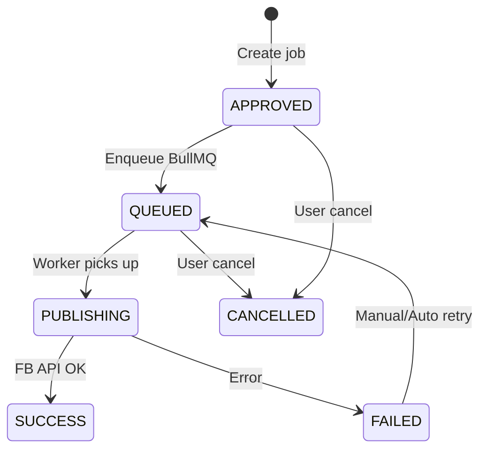

# 02 — Architecture

> Kiến trúc chi tiết cho triển khai coding

---

## 1. System Context

```text
┌─────────────────────────────────────────────────────────────────┐
│                        Social Publishing Platform                  │
│                                                                  │
│  ┌──────────┐    ┌──────────┐    ┌──────────┐    ┌──────────┐  │
│  │ Frontend │───▶│   API    │───▶│ Postgres │    │  Redis   │  │
│  │  React   │    │  NestJS  │    └──────────┘    └────┬─────┘  │
│  └──────────┘    └────┬─────┘                        │        │
│                        │                              │        │
│                        │         ┌──────────┐         │        │
│                        └────────▶│  Worker  │◀────────┘        │
│                                  │  NestJS  │                   │
│                                  └────┬─────┘                   │
└───────────────────────────────────────┼──────────────────────────┘
                                        │
                    ┌───────────────────┼───────────────────┐
                    ▼                   ▼                   ▼
              Google Sheets      Google Drive        Meta Graph API
```

---

## 2. Layered Architecture (Backend)

```text
┌─────────────────────────────────────────┐
│  Presentation Layer                      │
│  Controllers, DTOs, Swagger, Guards      │
├─────────────────────────────────────────┤
│  Application Layer                       │
│  Services (use cases), Scheduler         │
├─────────────────────────────────────────┤
│  Domain Layer                            │
│  Entities, Enums, Domain errors          │
├─────────────────────────────────────────┤
│  Infrastructure Layer                    │
│  Prisma repos, BullMQ, Google APIs, FB   │
└─────────────────────────────────────────┘
```

### Quy tắc phụ thuộc

- Controller → Service → Repository → Prisma
- Không import Prisma trong Controller
- External API (Google, Meta) wrap trong adapter/service infra

---

## 3. Module Map (NestJS)

| Module | Responsibility | Depends on |
|--------|----------------|------------|
| `AuthModule` | Login, refresh, JWT strategy | UsersModule |
| `UsersModule` | User CRUD | Prisma, AuditLogs |
| `FacebookPagesModule` | Page CRUD, token crypto | Prisma, AuditLogs |
| `ContentAssetsModule` | Content CRUD, approve | Prisma, AuditLogs |
| `GoogleSheetSyncModule` | Fetch sheet, map, upsert | ContentAssets, Google API |
| `PublishJobsModule` | CRUD jobs, cancel, retry | Prisma, BullMQ, AuditLogs |
| `SchedulerModule` | Cron scan APPROVED → queue | PublishJobs, BullMQ |
| `AuditLogsModule` | Write/read audit | Prisma |
| `DashboardModule` | Aggregations | Prisma |
| `HealthModule` | `/health`, readiness | Prisma, Redis |

**Worker app modules:**

| Module | Responsibility |
|--------|----------------|
| `PublishProcessorModule` | `@Processor('publish-post')` |
| `FacebookPublisherModule` | Graph API client |
| `MediaDownloadModule` | Download từ Drive URL |

---

## 4. Folder Structure (Backend Detail)

```text
backend/src/
├── main.ts
├── app.module.ts
├── common/
│   ├── decorators/
│   │   ├── roles.decorator.ts
│   │   ├── current-user.decorator.ts
│   │   └── audit-action.decorator.ts
│   ├── enums/
│   │   ├── role.enum.ts
│   │   ├── publish-status.enum.ts
│   │   └── media-type.enum.ts
│   ├── guards/
│   │   ├── jwt-auth.guard.ts
│   │   └── roles.guard.ts
│   ├── interceptors/
│   │   └── audit-log.interceptor.ts
│   ├── filters/
│   │   └── http-exception.filter.ts
│   └── utils/
│       ├── crypto.util.ts          # token encrypt/decrypt
│       └── pagination.util.ts
├── config/
│   ├── app.config.ts
│   ├── jwt.config.ts
│   ├── google.config.ts
│   └── meta.config.ts
├── prisma/
│   ├── prisma.module.ts
│   └── prisma.service.ts
└── modules/
    └── publish-jobs/
        ├── publish-jobs.module.ts
        ├── publish-jobs.controller.ts
        ├── publish-jobs.service.ts
        ├── publish-jobs.repository.ts
        ├── dto/
        │   ├── create-publish-job.dto.ts
        │   └── list-publish-jobs.dto.ts
        └── entities/
            └── publish-job.entity.ts
```

---

## 5. Request Flow Examples

### 5.1 Authenticated API Request

```text
HTTP Request
  → JwtAuthGuard (validate access token)
  → RolesGuard (check @Roles())
  → ValidationPipe (DTO)
  → Controller
  → Service (business logic)
  → Repository
  → Prisma
  → Response + AuditLogInterceptor (if @AuditAction)
```

### 5.2 Create Publish Job

```text
POST /api/publish-jobs
  → PublishJobsService.create()
      1. Validate content approved
      2. Validate page active
      3. Validate scheduled_at
      4. Insert publish_jobs (APPROVED)
      5. PublishQueueService.enqueue(jobId, delay)
      6. Update status → QUEUED
      7. Audit log
```

### 5.3 Worker Publish

```text
BullMQ job received
  → PublishPostProcessor.process()
      1. Load job + content + page (decrypt token)
      2. If CANCELLED/SUCCESS → skip (idempotent)
      3. Update → PUBLISHING
      4. MediaDownloadService.download(drive_url)
      5. FacebookPublisher.publish(media_type, ...)
      6. Update → SUCCESS + facebook_post_id
      OR catch → FAILED + error_message (BullMQ retry)
```

---

## 6. Scheduler Design

**Option A (khuyến nghị V1):** Enqueue ngay khi tạo job với `delay = scheduled_at - now`

```typescript
const delayMs = Math.max(0, scheduledAt.getTime() - Date.now());
await queue.add('publish-post', { publishJobId }, { delay: delayMs, ... });
```

**Option B:** Cron mỗi phút scan `APPROVED` jobs có `scheduled_at <= now`

- Dùng khi cần recovery nếu Redis mất job
- V1 có thể kết hợp: Option A + cron reconciliation mỗi 5 phút

### Reconciliation Cron

```text
Every 5 min:
  SELECT * FROM publish_jobs
  WHERE status = 'APPROVED' AND scheduled_at <= NOW()
  → enqueue + set QUEUED
```

---

## 7. Cross-Cutting Concerns

### 7.1 Error Handling

| Layer | Strategy |
|-------|----------|
| Validation | 400 Bad Request + field errors |
| Auth | 401 Unauthorized |
| RBAC | 403 Forbidden |
| Not found | 404 |
| Business rule | 409 Conflict (e.g. duplicate schedule) |
| External API | Wrap → domain error, log full response |

### 7.2 Logging

```typescript
// Structured log fields
{
  correlationId,
  userId,
  publishJobId,
  action: 'PUBLISH_START',
  durationMs
}
```

### 7.3 Token Encryption

```text
encrypt(plaintext, TOKEN_ENCRYPTION_KEY)
  → store: iv:authTag:ciphertext (base64)
decrypt on worker only when publishing
API list pages: mask token (show last 4 chars)
```

---

## 8. Frontend Architecture

```text
frontend/src/
├── api/                 # axios instance + API functions
├── hooks/               # useAuth, usePublishJobs, ...
├── contexts/
│   └── AuthContext.tsx
├── routes/
│   └── AppRoutes.tsx    # role-based route guard
├── pages/
│   ├── Dashboard/
│   ├── ContentLibrary/
│   ├── PublishScheduler/
│   ├── QueueMonitor/
│   ├── FailedJobs/
│   ├── PageManagement/
│   ├── UserManagement/
│   └── AuditLogs/
├── components/
│   ├── layout/          # Sidebar, Header
│   └── common/          # StatusTag, RoleBadge
└── utils/
    └── permissions.ts   # can(user, 'content:approve')
```

### State Management

- **React Query** — server state (lists, detail, mutations)
- **Auth Context** — user + tokens
- Không Redux V1

### Route Guard Matrix

| Route | ADMIN | CONTENT | PUBLISHER | VIEWER |
|-------|-------|---------|-----------|--------|
| /dashboard | ✓ | ✓ | ✓ | ✓ |
| /content | ✓ | ✓ | read | read |
| /scheduler | ✓ | read | ✓ | read |
| /queue | ✓ | - | ✓ | read |
| /pages | ✓ | - | - | - |
| /users | ✓ | - | - | - |
| /audit | ✓ | - | - | - |

---

## 9. Integration Boundaries

### Google APIs

| API | Usage |
|-----|-------|
| Google Sheets API v4 | `spreadsheets.values.get` |
| Google Drive API v3 | `files.get` + `alt=media` export (nếu cần) |

Adapter: `GoogleSheetClient`, `GoogleDriveClient`

### Meta Graph API

Adapter: `FacebookGraphClient`

- Base URL: `https://graph.facebook.com/{version}`
- Timeout: 60s (video upload lâu hơn)
- Retry: chỉ 5xx/network — business errors không retry blind

---

## 10. Scalability Notes (V1 → V2)

| Concern | V1 | Scale path |
|---------|-----|------------|
| API | 1 instance | Horizontal + load balancer |
| Worker | 1 instance | N workers, same queue |
| Redis | Single | Redis Cluster / Sentinel |
| Media | Drive direct | MinIO cache layer |
| DB | Single Postgres | Read replica for dashboard |

---

## 11. Sequence: Full Publish Lifecycle



---

## 12. Coding Checklist per Module

Khi implement mỗi module, đảm bảo có:

- [ ] `*.module.ts` — imports/exports
- [ ] `*.controller.ts` — thin, Swagger decorators
- [ ] `*.service.ts` — business logic + unit tests
- [ ] `*.repository.ts` — Prisma queries
- [ ] `dto/*.dto.ts` — class-validator
- [ ] Guards applied at controller/method level
- [ ] Audit decorator trên mutation endpoints
