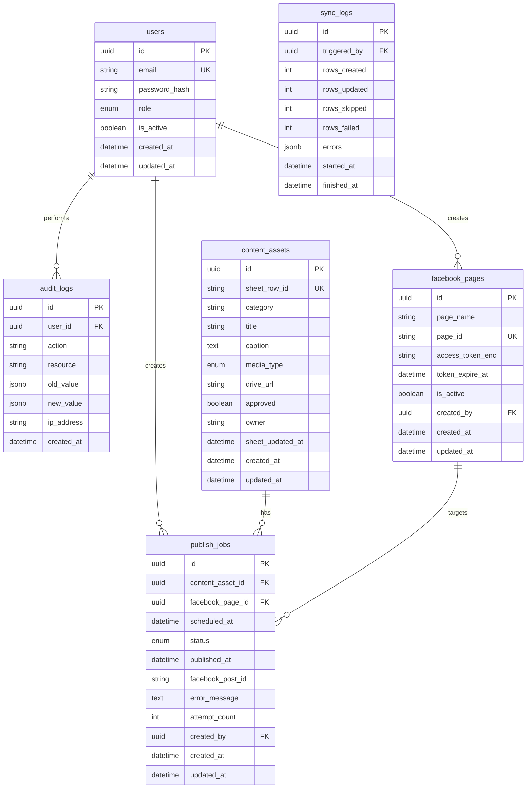

# 03 — Database Design

> Schema Prisma, indexes, migrations, và data rules

---

## 1. ERD



---

## 2. Prisma Schema (đầy đủ)

```prisma
// prisma/schema.prisma

generator client {
  provider = "prisma-client-js"
}

datasource db {
  provider = "postgresql"
  url      = env("DATABASE_URL")
}

enum UserRole {
  ADMIN
  CONTENT
  PUBLISHER
  VIEWER
}

enum MediaType {
  image
  video
}

enum PublishStatus {
  DRAFT
  APPROVED
  QUEUED
  PUBLISHING
  SUCCESS
  FAILED
  CANCELLED
}

model User {
  id           String   @id @default(uuid()) @db.Uuid
  email        String   @unique
  passwordHash String   @map("password_hash")
  role         UserRole @default(VIEWER)
  isActive     Boolean  @default(true) @map("is_active")
  createdAt    DateTime @default(now()) @map("created_at")
  updatedAt    DateTime @updatedAt @map("updated_at")

  publishJobs    PublishJob[]
  auditLogs      AuditLog[]
  facebookPages  FacebookPage[]
  syncLogs       SyncLog[]

  @@map("users")
}

model FacebookPage {
  id               String    @id @default(uuid()) @db.Uuid
  pageName         String    @map("page_name")
  pageId           String    @unique @map("page_id")
  accessTokenEnc   String    @map("access_token_enc") @db.Text
  tokenExpireAt    DateTime? @map("token_expire_at")
  isActive         Boolean   @default(true) @map("is_active")
  createdById      String    @map("created_by") @db.Uuid
  createdAt        DateTime  @default(now()) @map("created_at")
  updatedAt        DateTime  @updatedAt @map("updated_at")

  createdBy   User         @relation(fields: [createdById], references: [id])
  publishJobs PublishJob[]

  @@index([isActive])
  @@map("facebook_pages")
}

model ContentAsset {
  id              String    @id @default(uuid()) @db.Uuid
  sheetRowId      String    @unique @map("sheet_row_id")
  category        String?
  title           String
  caption         String    @db.Text
  mediaType       MediaType @map("media_type")
  driveUrl        String    @map("drive_url")
  approved        Boolean   @default(false)
  owner           String?
  sheetUpdatedAt  DateTime? @map("sheet_updated_at")
  createdAt       DateTime  @default(now()) @map("created_at")
  updatedAt       DateTime  @updatedAt @map("updated_at")

  publishJobs PublishJob[]

  @@index([approved])
  @@index([category])
  @@index([mediaType])
  @@map("content_assets")
}

model PublishJob {
  id              String        @id @default(uuid()) @db.Uuid
  contentAssetId  String        @map("content_asset_id") @db.Uuid
  facebookPageId  String        @map("facebook_page_id") @db.Uuid
  scheduledAt     DateTime      @map("scheduled_at")
  status          PublishStatus @default(APPROVED)
  publishedAt     DateTime?     @map("published_at")
  facebookPostId  String?       @map("facebook_post_id")
  errorMessage    String?       @map("error_message") @db.Text
  attemptCount    Int           @default(0) @map("attempt_count")
  bullJobId       String?       @map("bull_job_id")
  createdById     String        @map("created_by") @db.Uuid
  createdAt       DateTime      @default(now()) @map("created_at")
  updatedAt       DateTime      @updatedAt @map("updated_at")

  contentAsset ContentAsset @relation(fields: [contentAssetId], references: [id])
  facebookPage FacebookPage @relation(fields: [facebookPageId], references: [id])
  createdBy    User         @relation(fields: [createdById], references: [id])

  @@index([status])
  @@index([scheduledAt])
  @@index([contentAssetId, facebookPageId, scheduledAt])
  @@map("publish_jobs")
}

model AuditLog {
  id        String   @id @default(uuid()) @db.Uuid
  userId    String   @map("user_id") @db.Uuid
  action    String
  resource  String
  oldValue  Json?    @map("old_value")
  newValue  Json?    @map("new_value")
  ipAddress String?  @map("ip_address")
  createdAt DateTime @default(now()) @map("created_at")

  user User @relation(fields: [userId], references: [id])

  @@index([userId])
  @@index([action])
  @@index([createdAt])
  @@map("audit_logs")
}

model SyncLog {
  id           String    @id @default(uuid()) @db.Uuid
  triggeredById String   @map("triggered_by") @db.Uuid
  rowsCreated  Int       @default(0) @map("rows_created")
  rowsUpdated  Int       @default(0) @map("rows_updated")
  rowsSkipped  Int       @default(0) @map("rows_skipped")
  rowsFailed   Int       @default(0) @map("rows_failed")
  errors       Json?
  startedAt    DateTime  @default(now()) @map("started_at")
  finishedAt   DateTime? @map("finished_at")

  triggeredBy User @relation(fields: [triggeredById], references: [id])

  @@map("sync_logs")
}
```

---

## 3. Indexes Rationale

| Index | Lý do |
|-------|-------|
| `content_assets.sheet_row_id` UNIQUE | Dedup sync |
| `publish_jobs(status)` | Filter queue/failed |
| `publish_jobs(scheduled_at)` | Calendar + cron reconciliation |
| `publish_jobs(content, page, scheduled)` | Detect duplicate schedule |
| `audit_logs(created_at)` | Time-range queries |
| `facebook_pages.page_id` UNIQUE | Meta API identifier |

---

## 4. Migration Strategy

### Initial migration

```bash
cd backend
npx prisma migrate dev --name init
```

### Seed data (`prisma/seed.ts`)

```typescript
// Tạo admin mặc định (đổi password sau login)
const admin = await prisma.user.upsert({
  where: { email: 'admin@company.local' },
  update: {},
  create: {
    email: 'admin@company.local',
    passwordHash: await bcrypt.hash('ChangeMe123!', 12),
    role: 'ADMIN',
  },
});
```

Chạy: `npx prisma db seed`

---

## 5. Repository Patterns

### PublishJobsRepository — ví dụ queries

```typescript
// findDueForReconciliation
findApprovedDue(now: Date) {
  return this.prisma.publishJob.findMany({
    where: {
      status: PublishStatus.APPROVED,
      scheduledAt: { lte: now },
    },
  });
}

// optimistic lock khi worker pickup
updateStatusIfCurrent(id: string, from: PublishStatus, to: PublishStatus) {
  return this.prisma.publishJob.updateMany({
    where: { id, status: from },
    data: { status: to },
  });
}
```

### Idempotent worker pickup

Chỉ transition `QUEUED → PUBLISHING` nếu `updateMany.count === 1` — tránh double publish.

---

## 6. Data Validation Rules (DB + App)

| Field | Constraint |
|-------|------------|
| `users.email` | Unique, lowercase trim |
| `facebook_pages.page_id` | Numeric string (Meta page ID) |
| `content_assets.caption` | Max 63206 chars (app validate) |
| `publish_jobs.scheduled_at` | Timezone UTC stored |
| `publish_jobs.attempt_count` | Increment mỗi lần worker try |

---

## 7. Status Transition Matrix

| From \ To | QUEUED | PUBLISHING | SUCCESS | FAILED | CANCELLED |
|-----------|--------|------------|---------|--------|-----------|
| APPROVED | ✓ | - | - | - | ✓ |
| QUEUED | - | ✓ | - | - | ✓ |
| PUBLISHING | - | - | ✓ | ✓ | - |
| FAILED | ✓ (retry) | - | - | - | ✓ |
| SUCCESS | - | - | - | - | - |
| CANCELLED | - | - | - | - | - |

Enforce trong `PublishJobsService.updateStatus()` — throw nếu invalid transition.

---

## 8. Soft Delete vs Hard Delete

| Entity | Strategy V1 |
|--------|-------------|
| users | Soft: `is_active=false` |
| facebook_pages | Soft: `is_active=false` |
| content_assets | Hard delete chỉ ADMIN; prefer keep history |
| publish_jobs | Never delete — CANCELLED terminal |

---

## 9. Dashboard Queries

```sql
-- Posts by status in date range
SELECT status, COUNT(*)
FROM publish_jobs
WHERE scheduled_at BETWEEN $1 AND $2
GROUP BY status;

-- Daily success rate (7 days)
SELECT DATE(published_at) AS day,
       COUNT(*) FILTER (WHERE status = 'SUCCESS') AS success,
       COUNT(*) FILTER (WHERE status = 'FAILED') AS failed
FROM publish_jobs
WHERE published_at >= NOW() - INTERVAL '7 days'
GROUP BY day
ORDER BY day;
```

Implement trong `DashboardRepository` dùng Prisma `$queryRaw` hoặc aggregate.

---

## 10. Backup & Retention

| Data | Retention V1 |
|------|--------------|
| publish_jobs | Giữ vĩnh viễn |
| audit_logs | 1 năm (cron purge V2) |
| sync_logs | 90 ngày |

---

## 11. Implementation Tasks

- [ ] Tạo `schema.prisma` theo spec trên
- [ ] Migration init + seed admin
- [ ] `PrismaService` global module
- [ ] Repository base interface (optional)
- [ ] Unit test repositories với test DB hoặc mock
- [ ] Document timezone: **lưu UTC**, UI convert `Asia/Ho_Chi_Minh`
