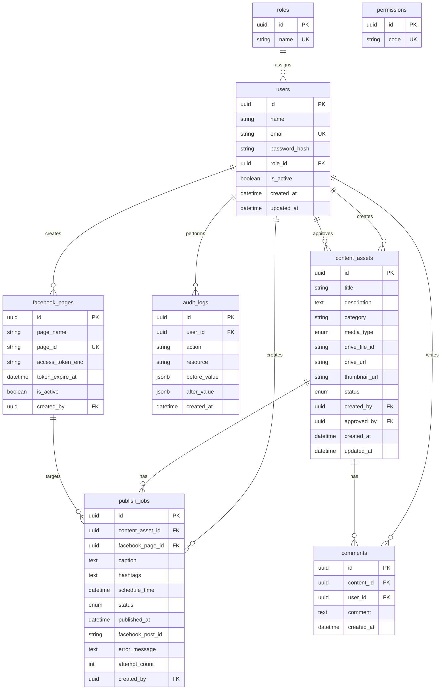

# 03 — Database Design

> Schema Prisma, indexes, migrations — v2.0

---

## 1. ERD



---

## 2. Enums

```prisma
enum UserRole {
  ADMIN
  CONTENT
  REVIEWER
  PUBLISHER
}

enum MediaType {
  image
  video
}

enum ContentStatus {
  DRAFT
  WAITING_APPROVAL
  APPROVED
  REJECTED
}

enum PublishStatus {
  SCHEDULED
  QUEUED
  PUBLISHING
  SUCCESS
  FAILED
  CANCELLED
}
```

---

## 3. Prisma Schema

```prisma
generator client {
  provider = "prisma-client-js"
}

datasource db {
  provider = "postgresql"
  url      = env("DATABASE_URL")
}

model Role {
  id   String @id @default(uuid()) @db.Uuid
  name String @unique

  users User[]

  @@map("roles")
}

model Permission {
  id   String @id @default(uuid()) @db.Uuid
  code String @unique

  @@map("permissions")
}

model User {
  id           String   @id @default(uuid()) @db.Uuid
  name         String
  email        String   @unique
  passwordHash String   @map("password_hash")
  role         UserRole @default(CONTENT)
  isActive     Boolean  @default(true) @map("is_active")
  createdAt    DateTime @default(now()) @map("created_at")
  updatedAt    DateTime @updatedAt @map("updated_at")

  contentCreated   ContentAsset[] @relation("ContentCreator")
  contentApproved  ContentAsset[] @relation("ContentApprover")
  publishJobs      PublishJob[]
  comments         Comment[]
  auditLogs        AuditLog[]
  facebookPages    FacebookPage[]

  @@map("users")
}

model FacebookPage {
  id             String    @id @default(uuid()) @db.Uuid
  pageName       String    @map("page_name")
  pageId         String    @unique @map("page_id")
  accessTokenEnc String    @map("access_token_enc") @db.Text
  tokenExpireAt  DateTime? @map("token_expire_at")
  isActive       Boolean   @default(true) @map("is_active")
  createdById    String    @map("created_by") @db.Uuid
  createdAt      DateTime  @default(now()) @map("created_at")
  updatedAt      DateTime  @updatedAt @map("updated_at")

  createdBy   User         @relation(fields: [createdById], references: [id])
  publishJobs PublishJob[]

  @@index([isActive])
  @@map("facebook_pages")
}

model ContentAsset {
  id            String        @id @default(uuid()) @db.Uuid
  title         String
  description   String?       @db.Text
  category      String?
  mediaType     MediaType     @map("media_type")
  driveFileId   String        @map("drive_file_id")
  driveUrl      String?       @map("drive_url")
  thumbnailUrl  String?       @map("thumbnail_url")
  mimeType      String?       @map("mime_type")
  fileSize      BigInt?       @map("file_size")
  status        ContentStatus @default(DRAFT)
  createdById   String        @map("created_by") @db.Uuid
  approvedById  String?       @map("approved_by") @db.Uuid
  createdAt     DateTime      @default(now()) @map("created_at")
  updatedAt     DateTime      @updatedAt @map("updated_at")

  createdBy   User         @relation("ContentCreator", fields: [createdById], references: [id])
  approvedBy  User?        @relation("ContentApprover", fields: [approvedById], references: [id])
  publishJobs PublishJob[]
  comments    Comment[]

  @@index([status])
  @@index([category])
  @@index([mediaType])
  @@index([createdById])
  @@map("content_assets")
}

model PublishJob {
  id              String        @id @default(uuid()) @db.Uuid
  contentAssetId  String        @map("content_asset_id") @db.Uuid
  facebookPageId  String        @map("facebook_page_id") @db.Uuid
  caption         String        @db.Text
  hashtags        String?       @db.Text
  scheduleTime    DateTime      @map("schedule_time")
  status          PublishStatus @default(SCHEDULED)
  publishedAt     DateTime?     @map("published_at")
  facebookPostId  String?       @map("facebook_post_id")
  errorMessage    String?       @map("error_message") @db.Text
  attemptCount    Int           @default(0) @map("attempt_count")
  bullJobId       String?       @map("bull_job_id")
  createdById     String        @map("created_by") @db.Uuid
  createdAt       DateTime      @default(now()) @map("created_at")
  updatedAt       DateTime      @updatedAt @map("updated_at")

  contentAsset ContentAsset @relation(fields: [contentAssetId], references: [id])
  facebookPage FacebookPage @relation(fields: [facebookPageId], references: [id])
  createdBy    User         @relation(fields: [createdById], references: [id])

  @@index([status])
  @@index([scheduleTime])
  @@index([contentAssetId, facebookPageId, scheduleTime])
  @@map("publish_jobs")
}

model Comment {
  id        String   @id @default(uuid()) @db.Uuid
  contentId String   @map("content_id") @db.Uuid
  userId    String   @map("user_id") @db.Uuid
  comment   String   @db.Text
  createdAt DateTime @default(now()) @map("created_at")

  content ContentAsset @relation(fields: [contentId], references: [id], onDelete: Cascade)
  user    User         @relation(fields: [userId], references: [id])

  @@index([contentId])
  @@map("comments")
}

model AuditLog {
  id         String   @id @default(uuid()) @db.Uuid
  userId     String   @map("user_id") @db.Uuid
  action     String
  resource   String
  beforeValue Json?   @map("before_value")
  afterValue  Json?   @map("after_value")
  ipAddress  String?  @map("ip_address")
  createdAt  DateTime @default(now()) @map("created_at")

  user User @relation(fields: [userId], references: [id])

  @@index([userId])
  @@index([action])
  @@index([createdAt])
  @@map("audit_logs")
}
```

---

## 4. Indexes Rationale

| Index | Lý do |
|-------|-------|
| `content_assets(status)` | Filter theo workflow state |
| `content_assets(created_by)` | Content user xem bài của mình |
| `publish_jobs(status)` | Queue/failed monitor |
| `publish_jobs(schedule_time)` | Calendar + reconciliation |
| `comments(content_id)` | Review history |
| `facebook_pages.page_id` UNIQUE | Meta API identifier |

---

## 5. Content Status Transitions

| From \ To | WAITING_APPROVAL | APPROVED | REJECTED | DRAFT |
|-----------|------------------|----------|----------|-------|
| DRAFT | ✓ (submit) | - | - | - |
| REJECTED | ✓ (resubmit) | - | - | ✓ (edit) |
| WAITING_APPROVAL | - | ✓ | ✓ | - |
| APPROVED | - | - | - | - |

Enforce trong `ContentAssetsService.transitionStatus()`.

---

## 6. Publish Job Status Transitions

| From \ To | QUEUED | PUBLISHING | SUCCESS | FAILED | CANCELLED |
|-----------|--------|------------|---------|--------|-----------|
| SCHEDULED | ✓ | - | - | - | ✓ |
| QUEUED | - | ✓ | - | - | ✓ |
| PUBLISHING | - | - | ✓ | ✓ | - |
| FAILED | ✓ (retry) | - | - | - | ✓ |

---

## 7. Data Rules

| Field | Constraint |
|-------|------------|
| `users.email` | Unique, lowercase trim |
| `content_assets.drive_file_id` | Required khi submit review |
| `content_assets` media | DB không lưu binary — chỉ metadata |
| `publish_jobs.caption` | Max 63206 chars |
| `publish_jobs.schedule_time` | UTC stored, UI `Asia/Ho_Chi_Minh` |
| `publish_jobs.attempt_count` | Increment mỗi worker try |

---

## 8. Seed Data

```typescript
// prisma/seed.ts
const roles = ['ADMIN', 'CONTENT', 'REVIEWER', 'PUBLISHER'];
for (const name of roles) {
  await prisma.role.upsert({ where: { name }, update: {}, create: { name } });
}

await prisma.user.upsert({
  where: { email: 'admin@company.local' },
  update: {},
  create: {
    name: 'System Admin',
    email: 'admin@company.local',
    passwordHash: await bcrypt.hash('ChangeMe123!', 12),
    role: 'ADMIN',
  },
});
```

---

## 9. Dashboard Queries

```sql
-- Content by status
SELECT status, COUNT(*) FROM content_assets GROUP BY status;

-- Publish by status (date range)
SELECT status, COUNT(*)
FROM publish_jobs
WHERE schedule_time BETWEEN $1 AND $2
GROUP BY status;

-- Top content creators
SELECT u.name, COUNT(c.id) AS content_count
FROM content_assets c
JOIN users u ON c.created_by = u.id
WHERE c.created_at >= NOW() - INTERVAL '30 days'
GROUP BY u.id, u.name
ORDER BY content_count DESC
LIMIT 10;
```

---

## 10. Implementation Tasks

- [ ] `schema.prisma` theo spec trên
- [ ] Migration init + seed roles + admin
- [ ] `PrismaService` global module
- [ ] Repository per aggregate
- [ ] Unit test status transition logic
- [ ] Document timezone: **UTC in DB**, UI convert local
