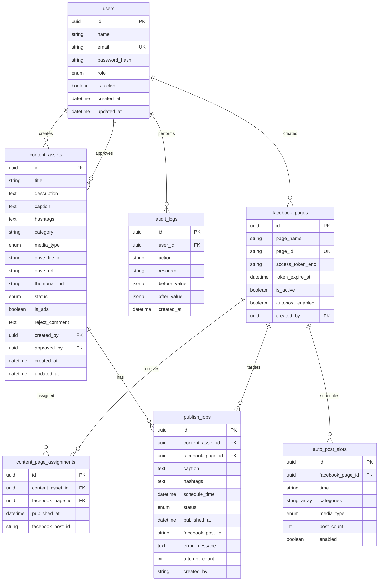

# 03 — Database Design

> Schema Prisma, indexes, migrations — v3.0 (mô hình Auto-Post)

---

## 1. ERD



---

## 2. Enums

```prisma
enum UserRole {
  ADMIN
  EDITOR
  CONTENT
}

enum MediaType {
  image
  video
}

enum SlotMediaType {
  image
  video
  all
}

enum ContentStatus {
  PENDING_REVIEW   // Chờ duyệt (mặc định sau upload — không có DRAFT)
  APPROVED         // Đã duyệt — pool cho bot lấy đăng
  REJECTED         // Không duyệt — bắt buộc reject_comment
  PUBLISHING       // Đang đăng — bot cập nhật
  PUBLISHED        // Đã đăng (≥ 1 page thành công) — bot cập nhật
}

enum PublishStatus {
  SCHEDULED
  QUEUED
  PUBLISHING
  SUCCESS
  FAILED
  CANCELLED
}
```

---

## 3. Prisma Schema

```prisma
generator client {
  provider = "prisma-client-js"
}

datasource db {
  provider = "postgresql"
  url      = env("DATABASE_URL")
}

model User {
  id           String   @id @default(uuid()) @db.Uuid
  name         String
  email        String   @unique
  passwordHash String   @map("password_hash")
  role         UserRole @default(CONTENT)
  isActive     Boolean  @default(true) @map("is_active")
  createdAt    DateTime @default(now()) @map("created_at")
  updatedAt    DateTime @updatedAt @map("updated_at")

  contentCreated  ContentAsset[] @relation("ContentCreator")
  contentApproved ContentAsset[] @relation("ContentApprover")
  auditLogs       AuditLog[]
  facebookPages   FacebookPage[]

  @@map("users")
}

model FacebookPage {
  id              String    @id @default(uuid()) @db.Uuid
  pageName        String    @map("page_name")
  pageId          String    @unique @map("page_id")
  accessTokenEnc  String    @map("access_token_enc") @db.Text
  tokenExpireAt   DateTime? @map("token_expire_at")
  isActive        Boolean   @default(true) @map("is_active")
  autopostEnabled Boolean   @default(false) @map("autopost_enabled")
  createdById     String    @map("created_by") @db.Uuid
  createdAt       DateTime  @default(now()) @map("created_at")
  updatedAt       DateTime  @updatedAt @map("updated_at")

  createdBy    User                    @relation(fields: [createdById], references: [id])
  publishJobs  PublishJob[]
  assignments  ContentPageAssignment[]
  autoPostSlots AutoPostSlot[]

  @@index([isActive])
  @@map("facebook_pages")
}

model ContentAsset {
  id            String        @id @default(uuid()) @db.Uuid
  title         String
  description   String?       @db.Text
  caption       String        @db.Text          // Bot dùng khi đăng
  hashtags      String?       @db.Text
  category      String                          // "Dạng" bài
  mediaType     MediaType     @map("media_type")
  driveFileId   String        @map("drive_file_id")
  driveUrl      String?       @map("drive_url")
  thumbnailUrl  String?       @map("thumbnail_url")
  mimeType      String?       @map("mime_type")
  fileSize      BigInt?       @map("file_size")
  status        ContentStatus @default(PENDING_REVIEW)
  isAds         Boolean       @default(false) @map("is_ads")  // Đạt ADS
  rejectComment String?       @map("reject_comment") @db.Text
  createdById   String        @map("created_by") @db.Uuid
  approvedById  String?       @map("approved_by") @db.Uuid
  createdAt     DateTime      @default(now()) @map("created_at")  // Ngày upload
  updatedAt     DateTime      @updatedAt @map("updated_at")        // = thời điểm duyệt gần nhất

  createdBy   User                    @relation("ContentCreator", fields: [createdById], references: [id])
  approvedBy  User?                   @relation("ContentApprover", fields: [approvedById], references: [id])
  publishJobs PublishJob[]
  assignments ContentPageAssignment[]

  @@index([status])
  @@index([category])
  @@index([mediaType])
  @@index([createdById])
  @@index([isAds])
  @@index([status, updatedAt])   // Cron picker: APPROVED order by updated_at ASC
  @@map("content_assets")
}

// Phân bổ content → page. published_at != null nghĩa là ĐÃ đăng trên page đó.
// UNIQUE(content, page) enforce rule "mỗi bài chỉ đăng 1 lần / 1 page".
model ContentPageAssignment {
  id             String    @id @default(uuid()) @db.Uuid
  contentAssetId String    @map("content_asset_id") @db.Uuid
  facebookPageId String    @map("facebook_page_id") @db.Uuid
  publishedAt    DateTime? @map("published_at")
  facebookPostId String?   @map("facebook_post_id")
  createdAt      DateTime  @default(now()) @map("created_at")

  contentAsset ContentAsset @relation(fields: [contentAssetId], references: [id], onDelete: Cascade)
  facebookPage FacebookPage @relation(fields: [facebookPageId], references: [id])

  @@unique([contentAssetId, facebookPageId])
  @@index([facebookPageId, publishedAt])
  @@map("content_page_assignments")
}

// Mốc giờ đăng tự động của từng page — config 1 lần, dùng suốt vòng đời.
model AutoPostSlot {
  id             String        @id @default(uuid()) @db.Uuid
  facebookPageId String        @map("facebook_page_id") @db.Uuid
  time           String                        // 'HH:mm' — giờ cố định trong ngày
  categories     String[]                      // các Dạng bài được phép đăng ở mốc này
  mediaType      SlotMediaType @default(all) @map("media_type")
  postCount      Int           @default(1) @map("post_count")
  enabled        Boolean       @default(true)
  createdAt      DateTime      @default(now()) @map("created_at")
  updatedAt      DateTime      @updatedAt @map("updated_at")

  facebookPage FacebookPage @relation(fields: [facebookPageId], references: [id], onDelete: Cascade)

  @@index([facebookPageId, enabled])
  @@map("auto_post_slots")
}

model PublishJob {
  id             String        @id @default(uuid()) @db.Uuid
  contentAssetId String        @map("content_asset_id") @db.Uuid
  facebookPageId String        @map("facebook_page_id") @db.Uuid
  caption        String        @db.Text
  hashtags       String?       @db.Text
  scheduleTime   DateTime      @map("schedule_time")
  status         PublishStatus @default(QUEUED)
  publishedAt    DateTime?     @map("published_at")
  facebookPostId String?       @map("facebook_post_id")
  errorMessage   String?       @map("error_message") @db.Text
  attemptCount   Int           @default(0) @map("attempt_count")
  bullJobId      String?       @map("bull_job_id")
  createdBy      String        @default("Bot") @map("created_by")  // luôn là Bot trong flow auto
  createdAt      DateTime      @default(now()) @map("created_at")
  updatedAt      DateTime      @updatedAt @map("updated_at")

  contentAsset ContentAsset @relation(fields: [contentAssetId], references: [id])
  facebookPage FacebookPage @relation(fields: [facebookPageId], references: [id])

  @@index([status])
  @@index([scheduleTime])
  @@index([contentAssetId, facebookPageId])
  @@map("publish_jobs")
}

model AuditLog {
  id          String   @id @default(uuid()) @db.Uuid
  userId      String?  @map("user_id") @db.Uuid   // null = Bot/system
  action      String
  resource    String
  beforeValue Json?    @map("before_value")
  afterValue  Json?    @map("after_value")
  ipAddress   String?  @map("ip_address")
  createdAt   DateTime @default(now()) @map("created_at")

  user User? @relation(fields: [userId], references: [id])

  @@index([userId])
  @@index([action])
  @@index([createdAt])
  @@map("audit_logs")
}
```

---

## 4. Indexes Rationale

| Index | Lý do |
|-------|-------|
| `content_assets(status, updated_at)` | Cron picker: lấy APPROVED, order `updated_at ASC` |
| `content_assets(is_ads)` | Dashboard đếm video đạt ADS |
| `content_page_assignments UNIQUE(content, page)` | **Enforce đăng 1 lần / 1 page** |
| `content_page_assignments(page, published_at)` | Dashboard bài đăng theo page |
| `auto_post_slots(page, enabled)` | Cron quét slot đến giờ |
| `publish_jobs(status)` / `(schedule_time)` | Queue/failed monitor + timeline |
| `facebook_pages.page_id` UNIQUE | Meta API identifier |

---

## 5. Content Status Transitions

| From \ To | PENDING_REVIEW | APPROVED | REJECTED | PUBLISHING | PUBLISHED |
|-----------|:---:|:---:|:---:|:---:|:---:|
| (upload) | ✓ mặc định | - | - | - | - |
| PENDING_REVIEW | - | ✓ EDITOR | ✓ EDITOR (+lý do) | - | - |
| REJECTED | ✓ (CONTENT sửa lại) | ✓ EDITOR | - | - | - |
| APPROVED | ✓ (EDITOR rút lại) | - | ✓ EDITOR | ✓ **Bot** | - |
| PUBLISHING | - | - | - | - | ✓ **Bot** (≥1 page OK) |
| PUBLISHED | - | - | - | ✓ **Bot** (page tiếp theo) | - |

- Người dùng (EDITOR/ADMIN) chỉ chuyển giữa 3 trạng thái duyệt.
- `PUBLISHING`/`PUBLISHED` chỉ do worker cập nhật. Enforce trong
  `ContentAssetsService.transitionStatus()`.

---

## 6. Publish Job Status Transitions

| From \ To | QUEUED | PUBLISHING | SUCCESS | FAILED | CANCELLED |
|-----------|--------|------------|---------|--------|-----------|
| SCHEDULED | ✓ | - | - | - | ✓ |
| QUEUED | - | ✓ | - | - | ✓ |
| PUBLISHING | - | - | ✓ | ✓ | - |
| FAILED | ✓ (retry) | - | - | - | ✓ |

Khi job SUCCESS → set `content_page_assignments.published_at` + `facebook_post_id`,
recompute content status (PUBLISHED nếu ≥ 1 assignment published).

---

## 7. Cron Picker Query (logic lấy bài)

```sql
-- Đến mốc giờ slot S của page P: chọn tối đa S.post_count bài
SELECT c.*
FROM content_assets c
JOIN content_page_assignments a
  ON a.content_asset_id = c.id
 AND a.facebook_page_id = $pageId
 AND a.published_at IS NULL          -- chưa đăng trên page này (unique 1 lần/page)
WHERE c.status IN ('APPROVED', 'PUBLISHED', 'PUBLISHING')
  -- PUBLISHED/PUBLISHING vẫn hợp lệ cho page KHÁC chưa đăng
  AND c.category = ANY($slot.categories)
  AND ($slot.media_type = 'all' OR c.media_type = $slot.media_type)
  AND NOT EXISTS (                    -- không tạo job trùng đang chờ
    SELECT 1 FROM publish_jobs j
    WHERE j.content_asset_id = c.id
      AND j.facebook_page_id = $pageId
      AND j.status IN ('QUEUED', 'PUBLISHING')
  )
ORDER BY c.updated_at ASC             -- duyệt sớm → đăng trước
LIMIT $slot.post_count;
```

---

## 8. Data Rules

| Field | Constraint |
|-------|------------|
| `users.email` | Unique, lowercase trim |
| `content_assets.caption` | Required — bot dùng khi đăng, max 63206 chars |
| `content_assets.reject_comment` | Required khi status → REJECTED |
| `content_assets` media | DB không lưu binary — chỉ metadata |
| `content_page_assignments` | UNIQUE(content, page) — không đăng lặp |
| `auto_post_slots.time` | 'HH:mm' 24h, timezone `Asia/Ho_Chi_Minh` |
| `publish_jobs.schedule_time` | UTC stored, UI `Asia/Ho_Chi_Minh` |

---

## 9. Seed Data

```typescript
// prisma/seed.ts
await prisma.user.upsert({
  where: { email: 'admin@company.local' },
  update: {},
  create: {
    name: 'System Admin',
    email: 'admin@company.local',
    passwordHash: await bcrypt.hash('ChangeMe123!', 12),
    role: 'ADMIN',
  },
});
// Roles là enum (ADMIN | EDITOR | CONTENT) — không cần bảng roles ở V1.
```

---

## 10. Dashboard Queries

```sql
-- Video đạt ADS (theo range)
SELECT COUNT(*) FROM content_assets
WHERE is_ads = true AND media_type = 'video'
  AND updated_at BETWEEN $1 AND $2;

-- Bài đăng theo page + media type (theo range)
SELECT p.page_name, c.media_type, COUNT(*)
FROM content_page_assignments a
JOIN facebook_pages p ON p.id = a.facebook_page_id
JOIN content_assets c ON c.id = a.content_asset_id
WHERE a.published_at BETWEEN $1 AND $2
GROUP BY p.page_name, c.media_type;

-- Content by status
SELECT status, COUNT(*) FROM content_assets GROUP BY status;

-- Publish jobs by status (range)
SELECT status, COUNT(*) FROM publish_jobs
WHERE schedule_time BETWEEN $1 AND $2 GROUP BY status;
```

---

## 11. Implementation Tasks

- [ ] `schema.prisma` theo spec trên (thêm `content_page_assignments`, `auto_post_slots`)
- [ ] Migration init + seed admin
- [ ] `PrismaService` global module
- [ ] Repository per aggregate
- [ ] Unit test: status transition + cron picker query (unique 1 lần/page, order updated_at)
- [ ] Document timezone: **UTC in DB**, UI convert `Asia/Ho_Chi_Minh`
