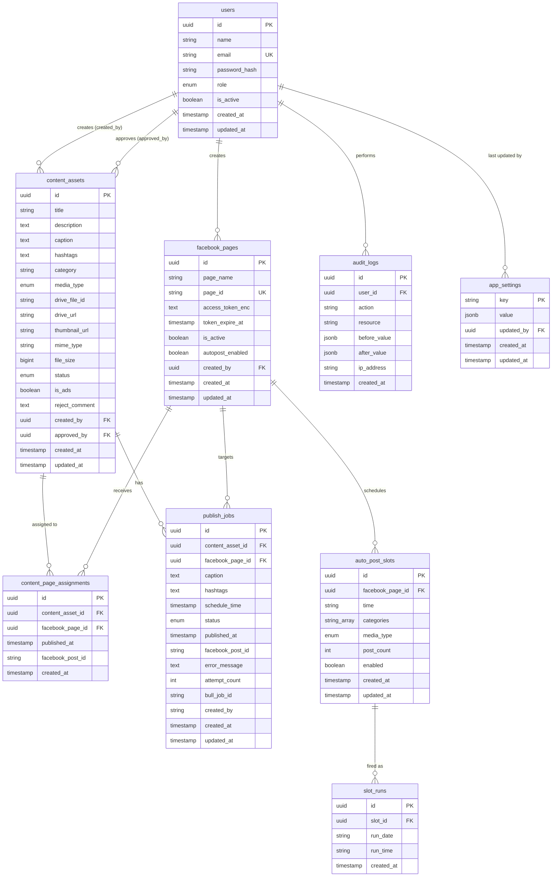

# ERD — Tool Auto FB

> **Bản đồ dữ liệu chính thức.** Mọi thay đổi schema PHẢI cập nhật file này —
> xem [.claude/rules/05-database-erd.md](./.claude/rules/05-database-erd.md).

**Cập nhật:** 2026-07-22
**Migration tương ứng:** `20260722153213_app_settings` (đã apply)
**Nguồn sự thật:** `backend/prisma/schema.prisma`

---

## 1. Sơ đồ

---

## 2. Enum

| Enum | Giá trị | Dùng ở |
|------|---------|--------|
| `UserRole` | `ADMIN` · `EDITOR` · `CONTENT` | `users.role` |
| `MediaType` | `image` · `video` | `content_assets.media_type` |
| `SlotMediaType` | `image` · `video` · `all` | `auto_post_slots.media_type` |
| `ContentStatus` | `PENDING_REVIEW` · `APPROVED` · `REJECTED` · `PUBLISHING` · `PUBLISHED` | `content_assets.status` |
| `PublishStatus` | `SCHEDULED` · `QUEUED` · `PUBLISHING` · `SUCCESS` · `FAILED` · `CANCELLED` | `publish_jobs.status` |

---

## 3. Index & Unique

| Bảng | Index | Lý do |
|------|-------|-------|
| `users` | UNIQUE `email` | Định danh đăng nhập |
| `facebook_pages` | UNIQUE `page_id` | Định danh phía Meta |
| `facebook_pages` | `is_active` | Lọc page đang dùng |
| `content_assets` | **`(status, updated_at)`** | **Cron picker: APPROVED order `updated_at ASC`** |
| `content_assets` | `status` · `category` · `media_type` · `created_by` · `is_ads` | Bộ lọc trang quản lý + dashboard |
| `content_page_assignments` | **UNIQUE `(content_asset_id, facebook_page_id)`** | **Mỗi bài chỉ đăng 1 lần trên 1 page** |
| `content_page_assignments` | `(facebook_page_id, published_at)` | Thống kê bài đã đăng theo page |
| `auto_post_slots` | `(facebook_page_id, enabled)` | Cron quét slot đến giờ |
| `slot_runs` | **UNIQUE `(slot_id, run_date, run_time)`** | **Chống cron double-fire (ADR-006)** |
| `publish_jobs` | `status` · `schedule_time` | Queue monitor + timeline |
| `publish_jobs` | `(content_asset_id, facebook_page_id)` | Kiểm tra job trùng trong picker |
| `audit_logs` | `user_id` · `action` · `created_at` | Truy vết |
| `app_settings` | PK `key` | Số dòng rất nhỏ (1 dòng/nhóm config), tra bằng khoá chính là đủ — không cần index phụ |

---

## 4. Ràng buộc nghiệp vụ (sơ đồ không diễn tả được)

| Ràng buộc | Nơi enforce |
|-----------|-------------|
| Mỗi content chỉ đăng **1 lần / 1 page** | UNIQUE `(content_asset_id, facebook_page_id)` + `published_at IS NULL` trong picker |
| `PUBLISHING` / `PUBLISHED` chỉ Bot được set | `ContentAssetsService.transitionStatus()` — client set ⇒ 422 |
| `status = REJECTED` bắt buộc có `reject_comment` | Service (400 nếu thiếu) |
| `content_assets.caption` bắt buộc (Bot dùng khi đăng) | DB NOT NULL + DTO |
| `auto_post_slots.time` = `'HH:mm'` theo `Asia/Ho_Chi_Minh` | DTO regex + comment trong entity |
| Không trùng `time` trong cùng một page | Service (409) |
| `access_token_enc` luôn là ciphertext AES-256-GCM | `crypto.util.ts`; API trả bản mask |
| Mọi timestamp lưu **UTC** | Prisma mặc định; UI convert sang `Asia/Ho_Chi_Minh` |
| `content_assets.updated_at` = mốc xếp hàng cho Bot (thời điểm duyệt gần nhất) | `@updatedAt` |
| Xóa page = soft delete (`is_active=false`) | Service — vì `publish_jobs` còn tham chiếu |
| `app_settings.key` ∈ `google_drive` \| `facebook` \| `system` | Service (DTO enum) — DB để string cho dễ mở rộng |
| Secret trong `app_settings.value` luôn là ciphertext AES-256-GCM | `CryptoService`; API trả bản mask, không trả JSON gốc |
| Không có bản ghi `app_settings` ⇒ đọc fallback từ `.env` | `SettingsService.getDriveConfig()` (ADR-014) |
| `app_settings['google_drive'].value` có `authMode ∈ service_account \| oauth2` (plan 03c). Field mã hoá: `serviceAccountJsonEnc`, `oauthClientSecretEnc`, `oauthRefreshTokenEnc` | Không đổi cột DB (JSONB) — shape do `settings.types.ts` định nghĩa |

**Cascade:** `content_page_assignments` xóa theo `content_assets`;
`auto_post_slots` xóa theo `facebook_pages`. `publish_jobs` **không** cascade (giữ lịch sử).

---

## 5. Lịch sử thay đổi

| Ngày | Migration | Nội dung |
|------|-----------|----------|
| 2026-07-24 | (không migration) | Plan 03c: mở rộng **shape JSONB** `app_settings['google_drive']` thêm `authMode` + field OAuth2 (`oauthClientId/oauthClientSecretEnc/oauthRefreshTokenEnc/oauthAccountEmail`). Không đổi cột/bảng nên không tạo migration. |
| 2026-07-22 | `20260722153213_app_settings` | Thêm bảng `app_settings` (key/value JSONB) cho cấu hình động sửa từ UI "Cài đặt chung" — bắt đầu với nhóm `google_drive` (ADR-014). Thêm quan hệ `users ||--o{ app_settings`. |
| 2026-07-22 | `20260722145631_init` | Khởi tạo 8 bảng theo `docs/03-database-design.md` + bổ sung `slot_runs` chống cron double-fire (ADR-006). Đã verify khớp `\dt` trên Postgres. |
