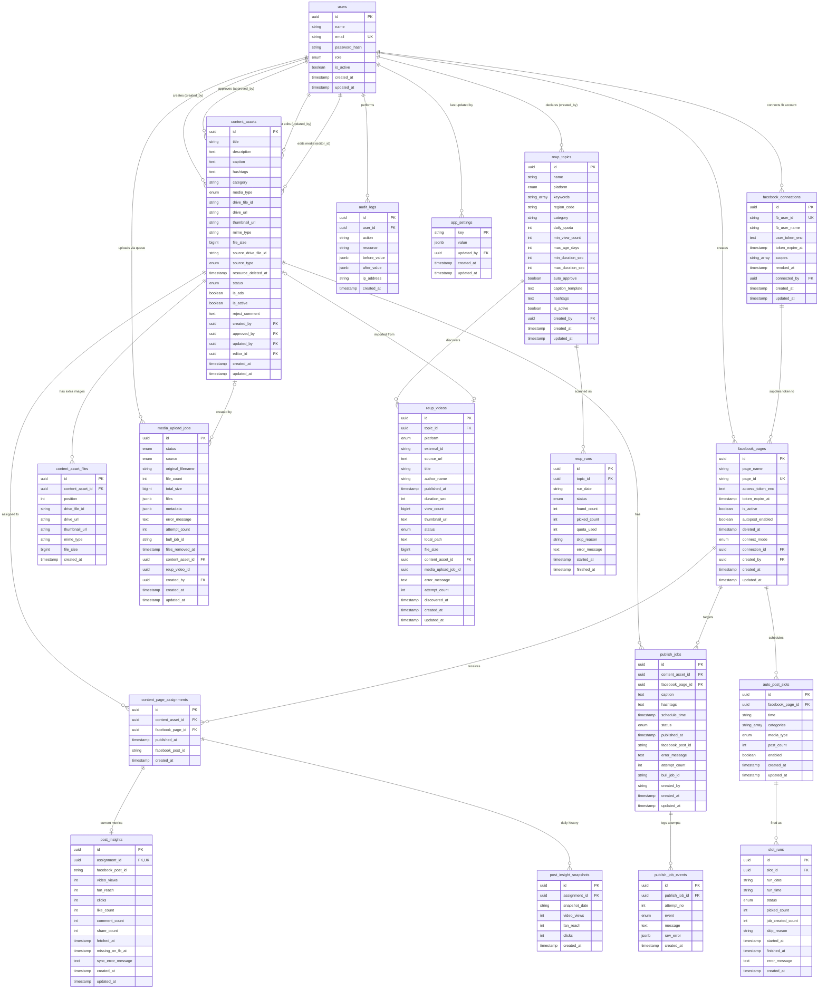

# ERD — Tool Auto FB

> **Bản đồ dữ liệu chính thức.** Mọi thay đổi schema PHẢI cập nhật file này —
> xem [.claude/rules/05-database-erd.md](./.claude/rules/05-database-erd.md).

**Cập nhật:** 2026-08-15
**Migration tương ứng:** `20260815010000_reup_topics_videos_runs` (plan 27)
**Nguồn sự thật:** `backend/prisma/schema.prisma`

---

## 1. Sơ đồ

---

## 2. Enum

| Enum | Giá trị | Dùng ở |
|------|---------|--------|
| `UserRole` | `SUPER_ADMIN` · `ADMIN` · `EDITOR` · `CONTENT` | `users.role` |
| `ContentSource` | `MANUAL` · `REUP` | `content_assets.source_type` |
| `ReupPlatform` | `YOUTUBE` · `DOUYIN` · `TIKTOK` | `reup_topics.platform`, `reup_videos.platform` |
| `ReupVideoStatus` | `PENDING` · `DOWNLOADING` · `DOWNLOADED` · `UPLOADING` · `IMPORTED` · `FAILED` · `SKIPPED` | `reup_videos.status` |
| `ReupRunStatus` | `CLAIMED` · `DONE` · `SKIPPED` · `ERROR` | `reup_runs.status` |
| `MediaType` | `image` · `video` | `content_assets.media_type` |
| `SlotMediaType` | `image` · `video` · `all` | `auto_post_slots.media_type` |
| `ContentStatus` | `PENDING_REVIEW` · `APPROVED` · `REJECTED` · `PUBLISHING` · `PUBLISHED` | `content_assets.status` |
| `PublishStatus` | `SCHEDULED` · `QUEUED` · `PUBLISHING` · `SUCCESS` · `FAILED` · `CANCELLED` | `publish_jobs.status` |
| `SlotRunStatus` | `CLAIMED` · `DONE` · `SKIPPED` · `ERROR` | `slot_runs.status` |
| `PublishJobEventType` | `ENQUEUED` · `STARTED` · `SUCCEEDED` · `FAILED` · `RETRY_SCHEDULED` · `GAVE_UP` | `publish_job_events.event` |
| `FacebookConnectMode` | `MANUAL_TOKEN` · `FB_LOGIN` | `facebook_pages.connect_mode` |
| `MediaUploadStatus` | `QUEUED` · `UPLOADING_TO_DRIVE` · `COPYING_FROM_DRIVE` · `SUCCESS` · `FAILED` | `media_upload_jobs.status` |
| `MediaUploadSource` | `LOCAL_FILE` · `DRIVE_LINK` · `REUP` | `media_upload_jobs.source` |

---

## 3. Index & Unique

| Bảng | Index | Lý do |
|------|-------|-------|
| `users` | UNIQUE `email` | Định danh đăng nhập |
| `facebook_pages` | UNIQUE `page_id` | Định danh phía Meta |
| `facebook_pages` | `is_active` | Lọc page đang dùng (đang bật, chưa tạm dừng) |
| `facebook_pages` | `deleted_at` | Lọc page chưa bị xoá — điều kiện mặc định của mọi truy vấn nghiệp vụ |
| `facebook_pages` | `connection_id` | Lấy mọi page của một kết nối khi đồng bộ / ngắt kết nối |
| `facebook_connections` | UNIQUE `fb_user_id` | Một tài khoản Facebook chỉ có 1 kết nối — đăng nhập lại là cập nhật dòng cũ, không đẻ dòng mới |
| `facebook_connections` | `revoked_at` | Lọc kết nối còn hiệu lực |
| `content_assets` | **`(status, is_active, updated_at)`** | **Cron picker: APPROVED + đang dùng, order `updated_at ASC`** (thay index `(status, updated_at)` cũ) |
| `content_assets` | `is_active` | Lọc "Đang dùng / Ngưng dùng" ở trang quản lý |
| `content_assets` | `status` · `category` · `media_type` · `created_by` · `is_ads` | Bộ lọc trang quản lý + dashboard |
| `content_assets` | `editor_id` | Bộ lọc "Editor" (người dựng video) trên trang Quản lý Ảnh/Video |
| `content_page_assignments` | **UNIQUE `(content_asset_id, facebook_page_id)`** | **Mỗi bài chỉ đăng 1 lần trên 1 page** |
| `content_page_assignments` | `(facebook_page_id, published_at)` | Thống kê bài đã đăng theo page |
| `auto_post_slots` | `(facebook_page_id, enabled)` | Cron quét slot đến giờ |
| `slot_runs` | **UNIQUE `(slot_id, run_date, run_time)`** | **Chống cron double-fire (ADR-006)** — claim bằng INSERT, bắt P2002 |
| `slot_runs` | `(run_date, status)` | Xem nhật ký cron theo ngày / lọc slot bị SKIPPED–ERROR |
| `publish_job_events` | `(publish_job_id, created_at)` | Đọc nhật ký từng lần thử của một job theo thứ tự thời gian |
| `publish_jobs` | `status` · `schedule_time` | Queue monitor + timeline |
| `publish_jobs` | `(content_asset_id, facebook_page_id)` | Kiểm tra job trùng trong picker |
| `content_asset_files` | **UNIQUE `(content_asset_id, position)`** | Thứ tự ảnh trong bài là duy nhất, không nhập nhằng khi đăng album |
| `content_asset_files` | `content_asset_id` | Lấy toàn bộ ảnh phụ của một bài lúc đăng và lúc mở Drawer chi tiết |
| `media_upload_jobs` | `status` | Cron dọn job đã kết thúc (`SUCCESS`/`FAILED` quá TTL) |
| `media_upload_jobs` | `(source, status)` | Guard đếm job **`LOCAL_FILE`** đang `QUEUED`/`UPLOADING_TO_DRIVE` trước mỗi request upload (chạy rất thường xuyên). Job `DRIVE_LINK` không chiếm đĩa nên không bị đếm — xem plan 24 §3.5 |
| `content_assets` | `source_drive_file_id` | Cảnh báo "link Drive này đã nhập vào bài nào rồi" ở bước xem trước của nhập-từ-link |
| `media_upload_jobs` | `(created_by, status)` | FE poll "job upload của tôi" mỗi 3s trong lúc còn dòng "mờ" trên bảng |
| `post_insights` | **UNIQUE `assignment_id`** | **1 bài đã đăng = đúng 1 dòng số liệu hiện tại** — job đồng bộ dùng `upsert` theo khoá này nên chạy lại bao nhiêu lần cũng không đẻ dòng |
| `post_insights` | mọi cột số **NULLABLE, không default** | Phân biệt "chưa đo" (`NULL`) với "đo được 0" (`0`) — xem §4 |
| `post_insights` | `facebook_post_id` | Tra ngược từ ID bài Facebook về assignment khi debug số liệu lệch |
| `post_insight_snapshots` | **UNIQUE `(assignment_id, snapshot_date)`** | **Job chạy 4 lần/ngày vẫn chỉ để lại 1 dòng/ngày** — upsert theo khoá này, không cần dọn trùng |
| `content_assets` | `source_type` | Bộ lọc "Loại" của màn kho. Role thiếu `reup:view` bị **ép cứng** `MANUAL` ở service ⇒ đây là điều kiện WHERE chạy trên **mọi** request của màn đó |
| `reup_topics` | **UNIQUE `(name, platform)`** | Không khai trùng một chủ đề trên cùng nền tảng (409 thay vì 2 dòng đá nhau) |
| `reup_topics` | `is_active` | Cron discovery chỉ quét chủ đề đang bật |
| `reup_videos` | **UNIQUE `(platform, external_id)`** | **CHỐNG TẢI TRÙNG** — không có nó thì hôm sau cron tải lại đúng video hôm nay (QĐ-4) |
| `reup_videos` | UNIQUE `content_asset_id` | 1 bài trong kho ↔ tối đa 1 video nguồn |
| `reup_videos` | `status` | Queue lấy job + UI lọc theo trạng thái |
| `reup_videos` | `(topic_id, discovered_at)` | Tab "Video đã kéo" của một chủ đề, mới nhất trước |
| `reup_runs` | **UNIQUE `(topic_id, run_date)`** | **Chống cron double-fire** (khuôn ADR-006) — claim bằng INSERT, bắt P2002. Bấm "Quét ngay" 2 lần cùng ngày cũng chỉ 1 run |
| `reup_runs` | `(run_date, status)` | Tab "Nhật ký quét" xem theo ngày |
| `media_upload_jobs` | `reup_video_id` | Worker tra ngược từ job upload về `reup_videos` để đóng sổ (plan 29 §3.3 cách a) |
| `audit_logs` | `user_id` · `action` · `created_at` | Truy vết |
| `app_settings` | PK `key` | Số dòng rất nhỏ (1 dòng/nhóm config), tra bằng khoá chính là đủ — không cần index phụ |

---

## 4. Ràng buộc nghiệp vụ (sơ đồ không diễn tả được)

| Ràng buộc | Nơi enforce |
|-----------|-------------|
| Mỗi content chỉ đăng **1 lần / 1 page** | UNIQUE `(content_asset_id, facebook_page_id)` + `published_at IS NULL` trong picker |
| **`content_assets.source_type = REUP` vô hình với role thiếu `reup:view`** — không thấy ở danh sách, và truy cập lẻ theo id trả **404 (không phải 403)**: 403 tự nó xác nhận bài đó tồn tại. Role thường gửi `?sourceType=REUP` bị **bỏ qua**, ép cứng `MANUAL`, **không** ném lỗi (để màn kho dùng y như trước plan 27) | `ContentAssetsService.findAll()` + `getOrFail()` — **chỉ** ở service của màn kho |
| **Lọc `source_type` TUYỆT ĐỐI không được đặt ở repository dùng chung / Prisma middleware.** Cron picker, timeline, lịch đăng bài, dashboard, publish-jobs phải thấy **cả** bài REUP — đó là toàn bộ mục đích của reup. Đặt nhầm chỗ ⇒ Bot không bao giờ đăng bài reup **hoặc** dashboard đếm thiếu, và hỏng **âm thầm** | `ContentAssetsRepository.findMany()` là nơi **duy nhất** nhận field `sourceType`; picker dùng raw SQL không có điều kiện này |
| `content_assets.source_type` **phải set ngay lúc INSERT**, không UPDATE sau. Update sau tạo ra khoảng thời gian bài reup lọt vào màn kho của role thường | `ContentAssetsRepository.create()` nhận `sourceType`; không có đường update nào cho cột này |
| `reup_topics.min_duration_sec < max_duration_sec`; `daily_quota` 1..10; `max_age_days` 1..365; chủ đề `YOUTUBE` bắt buộc có ≥1 keyword | `ReupTopicsService` (400) — kiểm trên giá trị **sau khi gộp** với state cũ, vì PATCH chỉ gửi một nửa cặp field |
| Tối đa **20 chủ đề đang bật** cùng lúc (quota YouTube `search.list` = 100 units/lần, trần 10.000/ngày) | `ReupTopicsService.assertActiveTopicLimit()` (422) |
| Xoá chủ đề reup = **soft delete** (`is_active = false`). Xoá cứng sẽ CASCADE mất `reup_videos`, tức mất luôn `external_id` đang dùng để chống tải trùng | `ReupTopicsService.remove()` |
| `reup_topics.platform != YOUTUBE` ⇒ **vẫn lưu được**, nhưng cron bỏ qua (`SKIPPED/PLATFORM_NOT_SUPPORTED`). Cố ý không chặn ở DTO: người vận hành cần khai báo sẵn (QĐ-2) | `ReupTopicsService` trả cờ `isPlatformSupported`; cron kiểm lúc chạy |
| `PUBLISHING` / `PUBLISHED` chỉ Bot được set | `ContentAssetsService.transitionStatus()` — client set ⇒ 422 |
| `status = REJECTED` bắt buộc có `reject_comment` | Service (400 nếu thiếu) |
| `content_assets.caption` bắt buộc (Bot dùng khi đăng) | DB NOT NULL + DTO |
| `auto_post_slots.time` = `'HH:mm'` theo `Asia/Ho_Chi_Minh` | DTO regex + comment trong entity |
| Không trùng `time` trong cùng một page | Service (409) |
| `access_token_enc` luôn là ciphertext AES-256-GCM | `crypto.util.ts`; API trả bản mask |
| Mọi timestamp lưu **UTC** | Prisma mặc định; UI convert sang `Asia/Ho_Chi_Minh` |
| `content_assets.updated_at` = mốc xếp hàng cho Bot (thời điểm duyệt gần nhất) | `@updatedAt` |
| `content_assets.is_active` = **bài còn được đem ra dùng không**, độc lập với `status` (duyệt). `false` ⇒ Bot **không lấy nữa**, nhưng **không** gỡ bài đã đăng và không đụng `publish_jobs`. Mọi nơi *tiêu thụ* bài (cron picker, đếm kho, đăng tay, lịch đăng, dashboard) phải lọc `is_active = TRUE`; riêng `GET /content-assets` **cố ý không lọc** vì đó là màn quản kho | Picker raw SQL + `ContentAssetsService`; xem `plans/19-bulk-actions.md` §2.2 |
| `content_assets.editor_id` = người **dựng** video/ảnh (account role `EDITOR`, đang active). Khác hẳn `created_by` (người upload) và `updated_by` (người sửa gần nhất). Nullable — không bắt buộc. Ràng buộc "phải là EDITOR + active" kiểm ở **service**, DB chỉ ràng FK | `ContentAssetsService.assertEditorSelectable()` |
| `content_assets.updated_by` = người **sửa gần nhất** (không phải người duyệt — đó là `approved_by`). `null` = bài cũ có trước khi bật tracking | `ContentAssetsService.create()/update()` set `= actor.id` |
| Xóa page = soft delete (`deleted_at = now()`, kèm `is_active=false`) | Service — vì `publish_jobs` còn tham chiếu. **`deleted_at` (đã xoá, ẩn khỏi UI) khác `is_active` (tạm dừng, vẫn hiện ở UI)** — không dùng lẫn |
| Page có `deleted_at != null` coi như không tồn tại (list ẩn, GET/PUT/DELETE ⇒ 404, publisher không lấy được token) | `FacebookPagesRepository` lọc `deleted_at: null` ở `findMany`/`findById` |
| Thêm lại page có `page_id` đã bị xoá mềm ⇒ **hồi sinh** bản ghi cũ (không 409, không tạo dòng mới) | `FacebookPagesService.create()` — vì UNIQUE `page_id` áp cả trên dòng đã xoá |
| `facebook_pages.connect_mode = FB_LOGIN` ⇒ `connection_id` **phải** khác null; `MANUAL_TOKEN` ⇒ luôn null | `FacebookConnectService.importPages()` / `FacebookPagesService.create()` |
| Import trúng page đang `MANUAL_TOKEN` ⇒ **không tự ghi đè token**, trả `needsConfirm` để user xác nhận | `FacebookConnectService.importPages()` — ghi đè token System User đang chạy tốt bằng token cá nhân là hạ độ bền |
| Chỉ import page mà tài khoản có task `CREATE_CONTENT` | `FacebookConnectService.importPages()` (400 kèm lý do) |
| `post_insights` **chỉ** tồn tại cho bài **do tool đăng** — neo vào `content_page_assignments` có `published_at != null` AND `facebook_post_id != null`. Bài đăng thẳng trên Facebook (không qua tool) **cố ý không** được theo dõi | `PostInsightsRepository.findSyncTargets()` + plan 25 §0.1 |
| **Mọi cột số của `post_insights` là NULLABLE, không default.** `NULL` = chưa đo được chỉ số đó · `0` = đã đo và thật sự bằng 0. Cấm `?? 0` ở mọi tầng (adapter → repository → mapper → UI) | `PostInsightsRepository.saveInsight()` bỏ hẳn field khỏi `create`/`update` khi giá trị là `null`; UI hiện `—` |
| **Không lưu impressions/reach tổng** — Meta đã gỡ `post_impressions*`, `post_reach`, `page_impressions*` khỏi Graph API (đo thật 2026-08-08 trên v19→v23 đều `(#100) not a valid insights metric`). Chỉ số còn đọc được: `post_video_views`, `post_fan_reach`, `post_clicks` | `FacebookInsightsClient` — 3 hằng metric ở đầu file |
| `missing_on_fb_at` **chỉ** được set khi Graph trả `error_subcode = 33`. **Cấm** suy ra từ `code = 100` trần — Graph dùng 100 cho cả "tên metric sai", đánh dấu nhầm sẽ giết việc theo dõi một bài đang sống mà không ai biết | `FacebookInsightsClient.parseEntry()` |
| `missing_on_fb_at != null` ⇒ job đồng bộ **ngừng** chọn bài này (không retry vô hạn) | `PostInsightsRepository.findSyncCandidates()` lọc `missing_on_fb_at IS NULL` |
| Page thiếu scope `read_insights` ⇒ **skip cả page**, không gọi Graph lần nào | `InsightsSyncService.syncPage()` — 50 call chỉ để nhận 50 lỗi giống nhau là đốt rate limit vô ích |
| `facebook_connections.user_token_enc` là **long-lived user token** (~60 ngày), khác hẳn `facebook_pages.access_token_enc` (Page token, không hết hạn) | `FacebookConnectService.handleCallback()` |
| Ngắt kết nối = `revoked_at = now()` + `user_token_enc = null`; **không** đụng token của page đang chạy | `FacebookConnectService.revoke()` |
| `app_settings['facebook_app'].value` = `{ appId, appSecretEnc }`; không có bản ghi ⇒ fallback `META_APP_ID`/`META_APP_SECRET` trong `.env` | `SettingsService.getFacebookAppSettings()` (ADR-014) |
| `app_settings.key` ∈ `google_drive` \| `facebook_app` \| `system` | Service (DTO enum) — DB để string cho dễ mở rộng |
| Secret trong `app_settings.value` luôn là ciphertext AES-256-GCM | `CryptoService`; API trả bản mask, không trả JSON gốc |
| Không có bản ghi `app_settings` ⇒ đọc fallback từ `.env` | `SettingsService.getDriveConfig()` (ADR-014) |
| `app_settings['google_drive'].value` có `authMode ∈ service_account \| oauth2` (plan 03c). Field mã hoá: `serviceAccountJsonEnc`, `oauthClientSecretEnc`, `oauthRefreshTokenEnc` | Không đổi cột DB (JSONB) — shape do `settings.types.ts` định nghĩa |
| Một `slot_runs` = một lần cron chạm slot đó trong ngày. **Không có dòng nào = cron chưa chạy**, khác hẳn `SKIPPED` (cron chạy nhưng hết bài) | `SlotRunService.claim()/finish()` — INSERT rồi UPDATE cùng một hàng |
| `slot_runs.status = SKIPPED` bắt buộc có `skip_reason`; `ERROR` bắt buộc có `error_message` | `SlotRunService.finish()` |
| `publish_job_events.raw_error` **không được chứa access token** (đi qua `sanitizeRawError`) | `PublishJobEventsService.log()` — có unit test riêng |
| `content_asset_files` chỉ chứa ảnh **phụ** (`position >= 1`). Ảnh đầu tiên của bài vẫn là `content_assets.drive_file_id` (vị trí 0) ⇒ record 1 ảnh không cần backfill. Danh sách ảnh đầy đủ của một bài = `[content_assets.drive_file_id, ...content_asset_files ORDER BY position]` | `PublishJobsRepository.findForExecution()` (nơi **duy nhất** được ghép; xem `plans/22-content-multi-image.md` §3.2) |
| Chỉ `media_type = image` mới có `content_asset_files`; tối đa `MAX_IMAGES_PER_CONTENT_ASSET` (10) ảnh/bài | `ContentAssetsService.create()` (400) — Graph API không ghép nhiều video vào một bài feed |
| Danh sách ảnh của một bài **cố định lúc upload** — sửa bài không đổi được ảnh, muốn đổi thì xoá record và upload lại | `ContentAssetsService.update()` không nhận `extraFiles` |
| Mỗi lần cron chạm slot lấy tối đa `post_count` bài, mỗi bài ⇒ đúng **1** job; bài nhiều ảnh tự thành 1 bài album lúc publish, picker không cần biết | `AutoPostSchedulerService.runSlot()` |
| Bài album thành công ⇒ record `content_assets` đổi `PUBLISHED` + assignment ghi `facebook_post_id` của **bài feed** (mọi ảnh nằm chung một bài viết, không phải mỗi ảnh một bài) | `PublishJobsRepository.markSuccess()` |
| `media_upload_jobs.files` = mảng JSON `[{ originalFilename, mimeType, size, tempPath }]` **đúng thứ tự đăng** (phần tử 0 = ảnh đại diện); `metadata` = form lúc submit. Không tách bảng con vì dữ liệu này chỉ sống tới lúc job xong, không ai query theo từng file | `MediaUploadJobsRepository` (parse JSON → type thật cho service/worker) |
| `media_upload_jobs.files_removed_at != null` ⇒ file tạm đã bị dọn, **không "Thử lại" được nữa** (phải chọn lại file) | `MediaUploadJobsService.retry()` (422) |
| Job ở `QUEUED`/`UPLOADING_TO_DRIVE` **và `source = LOCAL_FILE`** là job **đang chiếm đĩa**; tổng số job như vậy bị chặn ở `MEDIA_UPLOAD_MAX_PENDING_JOBS` (mặc định 20) trên **toàn hệ thống**, không theo từng user ⇒ trần đĩa tạm ≈ 20 × file lớn nhất. Job `DRIVE_LINK` **không** bị đếm (copy server-side, 0 byte qua server) | `MediaUploadLimitGuard` (503) — chạy trước multer nên request bị từ chối chưa ghi byte nào |
| `source = DRIVE_LINK` ⇒ `files[].tempPath` **không tồn tại**, thay bằng `sourceFileId` (fileId gốc bên Drive người khác); job này luôn "Thử lại" được vì nguồn không nằm trên đĩa server ⇒ `files_removed_at` luôn null | `DriveImportsService`, `MediaUploadJobsService.removeTempFiles()` bỏ qua file không có `tempPath` |
| `content_assets.source_drive_file_id != null` ⇒ bài được nhập từ link Drive; `drive_file_id` là **bản copy** trong folder tool, xoá bài chỉ xoá bản copy, **file gốc bên Drive người khác không bị đụng tới** | `DriveImportsService.processImport()`, `ContentAssetsService.remove()` (chỉ xoá `drive_file_id`) |
| Nhập từ link mà **caption bỏ trống** ⇒ bài luôn vào `PENDING_REVIEW` kể cả actor là ADMIN (caption `'-'` là placeholder, không phải nội dung đăng được) | `ContentAssetsService.create()` với `forceReview` (plan 24 §0.3-1) |
| Job còn `QUEUED`/`UPLOADING_TO_DRIVE` lúc boot = worker chết giữa chừng ⇒ **không resume**, chuyển `FAILED` + xoá file tạm | `MediaUploadJobsService.onModuleInit()` |
| Bài do worker upload tạo ra vẫn mang actor = **người bấm Upload** (không phải Bot), đi qua đúng `ContentAssetsService.create()` của `POST /content-assets` ⇒ quyền duyệt/ownership/audit `CONTENT_UPLOAD` giống hệt | `MediaUploadJobsService.uploadAndCreateAsset()` |
| `publish_job_events` là nhật ký kỹ thuật (retry, lỗi Graph); `audit_logs` là dấu vết nghiệp vụ (`AUTO_PUBLISH`, actor = Bot ⇒ `user_id = null`) | Hai đường ghi tách bạch, không nhồi stacktrace vào audit |

**Cascade:** `content_page_assignments` và `content_asset_files` xóa theo
`content_assets`; `auto_post_slots` xóa theo `facebook_pages`; `slot_runs` xóa theo
`auto_post_slots`; `publish_job_events` xóa theo `publish_jobs`. `publish_jobs`
**không** cascade (giữ lịch sử). `media_upload_jobs.content_asset_id` dùng
`ON DELETE SET NULL` — xoá bài không được kéo theo nhật ký upload của nó.

---

## 5. Lịch sử thay đổi

| Ngày | Migration | Nội dung |
|------|-----------|----------|
| 2026-08-15 | `20260815010000_reup_topics_videos_runs` | **Plan 27 (nền dữ liệu reup).** **Hoàn toàn additive — không DROP, không đổi kiểu, không backfill.** (1) 4 enum mới: `ContentSource`, `ReupPlatform`, `ReupVideoStatus`, `ReupRunStatus`; thêm giá trị `REUP` cho `MediaUploadSource`. (2) 3 bảng mới: `reup_topics` (chủ đề người vận hành khai báo + bộ lọc + `daily_quota` + `auto_approve`), `reup_videos` (video nguồn đã phát hiện — UNIQUE `(platform, external_id)` là chỗ **chống tải trùng**), `reup_runs` (nhật ký cron, khuôn từ `slot_runs`, UNIQUE `(topic_id, run_date)` **chống double-fire**). (3) `content_assets` thêm **2 cột**: `source_type` (`DEFAULT 'MANUAL'` ⇒ toàn bộ bài cũ giữ nguyên hành vi) + `resource_deleted_at` (nullable, plan 30 dùng), kèm index `source_type`. (4) `media_upload_jobs.reup_video_id` (nullable) + index — điểm nối để worker upload có sẵn đóng sổ ngược về `reup_videos` (plan 29 §3.3 cách a); nhánh `NULL` = upload tay chạy **y như cũ**. Gộp sẵn `reup_runs.quota_used` và `MediaUploadSource.REUP` của plan 29 vào migration này để không phải `ALTER TYPE` thêm lần nữa. `source_type` chỉ dùng để **tách 2 menu**; metadata nguồn (link gốc, tác giả, view) nằm ở `reup_videos` chứ không nhồi vào `content_assets` (QĐ-4). |
| 2026-08-15 | `20260815000000_add_super_admin_role` | **Plan 26 (role SUPER_ADMIN).** Thêm **một giá trị** vào enum `UserRole`: `SUPER_ADMIN`, đặt `BEFORE 'ADMIN'` để thứ tự enum phản ánh thứ bậc quyền. **Không** đổi `@default(CONTENT)`, **không** đụng dòng dữ liệu nào ⇒ không cần backfill, mọi user cũ giữ nguyên role. `ALTER TYPE ... ADD VALUE` đứng **một mình** trong migration vì ở nhiều phiên bản Postgres nó không chạy được trong transaction cùng DDL khác. Lý do tồn tại: `ADMIN` trước đây nắm **toàn bộ** permission (`ROLE_PERMISSIONS[ADMIN] = PERMISSIONS`) nên không có cách nào tạo người quản trị đứng trên ADMIN; 2 permission mới `reup:view`/`reup:manage` (không lưu DB, hardcode ở `common/permissions.ts`) chỉ cấp cho `SUPER_ADMIN` để làm nền phân quyền cho menu Reup của plan 27→31. |
| 2026-08-08 | `20260808064846_post_insights_real_metrics` | **Plan 25 §8 — sửa sau khi đo Graph API thật.** Migration trước đặt sai giả định. (1) **Bỏ** `impressions`, `impressions_unique` ở cả 2 bảng: Meta đã **gỡ hẳn** họ `post_impressions*` / `post_reach` / `page_impressions*` khỏi Graph API — kiểm chứng trên v19·v20·v21·v22·v23 đều trả `(#100) The value must be a valid insights metric`, không phải lỗi quyền (token có `read_insights`, loại PAGE, `expires_at=0`). (2) **Thêm** `fan_reach` (`post_fan_reach`) và `clicks` (`post_clicks`) — 2 chỉ số còn đọc được cho mọi loại bài; `video_views` (`post_video_views`) giữ nguyên, chỉ có ở bài video. (3) **Mọi cột số chuyển sang NULLABLE, bỏ `DEFAULT 0`**, kể cả `like_count`/`comment_count`/`share_count`; `fetched_at` cũng thành nullable. Lý do: nhánh `create` cũ ghi `?? 0` nên lần đồng bộ đầu tiên mà không lấy được số sẽ **ghi 0 vào DB** ⇒ UI hiện "0 lượt xem" cho bài chưa hề đo được — đúng triệu chứng user gặp. Nay `NULL` = chưa đo, `0` = đo được 0. Bảng đang rỗng dữ liệu thật (4 dòng đều là lỗi) nên không cần backfill. |
| 2026-08-08 | `20260808054704_post_insights` | **Plan 25 (tracking lượt xem bài đã đăng).** Hai bảng mới, **không đụng bảng nào có sẵn** ngoài 2 quan hệ ngược trên `content_page_assignments`. (1) `post_insights` — số liệu **hiện tại** của 1 bài: `impressions`, `impressions_unique`, `video_views` (nullable = không phải video), `like_count`/`comment_count`/`share_count`, `fetched_at`, `missing_on_fb_at`, `sync_error_message`; UNIQUE `assignment_id` + index `facebook_post_id`. (2) `post_insight_snapshots` — ảnh chụp **theo ngày** (`snapshot_date` dạng `'YYYY-MM-DD'` theo `Asia/Ho_Chi_Minh`, cùng quy ước `slot_runs.run_date`), UNIQUE `(assignment_id, snapshot_date)`. **Lý do tách 2 bảng:** màn danh sách chỉ cần 1 join vào bảng "hiện tại", không phải `DISTINCT ON` trên bảng lịch sử mỗi lần render. **Lý do neo vào `content_page_assignments` chứ không `publish_jobs`:** assignment có UNIQUE `(content, page)` nên 1 bài = 1 dòng, còn 1 content retry nhiều lần đẻ nhiều `publish_jobs` ⇒ cộng view sẽ nhân đôi; và cả 2 đường đăng (Bot + đăng tay) đều đã ghi `facebook_post_id` vào assignment. Không thêm enum. Không cần backfill (bảng rỗng, job đồng bộ tự điền). |
| 2026-08-07 | `20260807130353_drive_link_import` | **Plan 24 (nhập bài từ link Google Drive).** Enum mới `MediaUploadSource` (`LOCAL_FILE`/`DRIVE_LINK`) + giá trị mới `COPYING_FROM_DRIVE` cho `MediaUploadStatus`; `media_upload_jobs.source` (NOT NULL, default `LOCAL_FILE` ⇒ **không cần backfill**) + index `(source, status)`; `content_assets.source_drive_file_id` (nullable) + index. Lý do: thêm đường thứ hai để đưa bài vào kho — dán link Drive, tool gọi `files.copy` (copy phía server Google, **0 byte qua backend**) về folder cấu hình. Dùng lại nguyên bảng `media_upload_jobs` của plan 23 nên dòng "mờ"/"Thử lại"/cron dọn không phải viết lại; cột `source` là thứ duy nhất phân biệt 2 luồng. `source_drive_file_id` chỉ để cảnh báo nhập trùng, **không** unique (user được phép cố ý nhập lại). |
| 2026-08-07 | `20260806171728_media_upload_jobs` | **Plan 23 (upload media qua hàng đợi).** Enum mới `MediaUploadStatus` (`QUEUED`/`UPLOADING_TO_DRIVE`/`SUCCESS`/`FAILED`) + bảng mới `media_upload_jobs` (`original_filename`, `file_count`, `total_size`, `files` jsonb, `metadata` jsonb, `error_message`, `attempt_count`, `bull_job_id`, `files_removed_at`, `content_asset_id` FK `SET NULL`, `created_by` FK), index `status` và `(created_by, status)`. Lý do: bấm "Upload" không được đứng chờ Drive nữa — request chỉ nhận file xuống đĩa rồi trả 202, worker BullMQ `media-upload` (queue thứ 2 của dự án) đẩy lên Drive và tạo `content_assets` sau. **Hệ quả kiến trúc:** đảo ngược "chỉ stream, không ghi file xuống disk" (`PLAN-MVP.md` §4) — file phải sống ngoài vòng đời request; đổi lại có `MEDIA_UPLOAD_MAX_PENDING_JOBS` chặn trần đĩa + TTL dọn định kỳ. **Không đụng bảng nào có sẵn** ngoài 2 quan hệ ngược trên `users`/`content_assets`. |
| 2026-08-06 | `20260806*_content_asset_files` | **Plan 22 (nhiều ảnh trong 1 content record) — migration ĐẢO NGƯỢC MỘT PHẦN `20260805170928_album_post`.** (1) **Xoá** `auto_post_slots.assets_per_post` và **xoá nguyên bảng** `publish_job_assets`. (2) Bảng mới `content_asset_files` (`content_asset_id`, `position >= 1`, `drive_file_id`, `drive_url`, `thumbnail_url`, `mime_type`, `file_size`), UNIQUE `(content_asset_id, position)`, cascade theo `content_assets`. **Lý do đảo ngược (quyết định user 2026-08-06):** hướng cũ để Bot tự ghép N record rời rạc thành 1 album — phức tạp (picker phải loại 2 đường), chỉ chạy được với auto-post, và không giúp gì cho đăng tay. Hướng mới gom nhiều ảnh ngay ở **1 record lúc upload** ⇒ picker quay lại đơn giản (1 job/1 content), đăng tay **tự động** có album mà không phải code thêm. Kiểm tra trước khi migrate: `publish_job_assets` = 0 dòng, mọi slot `assets_per_post = 1` ⇒ không mất dữ liệu. |
| 2026-08-06 | `20260805170928_album_post` | **Plan 21 (đăng nhiều ảnh trong 1 bài).** (1) Thêm `auto_post_slots.assets_per_post` (int, `DEFAULT 1` ⇒ mốc giờ cũ giữ nguyên hành vi 1 ảnh/bài). (2) Bảng mới `publish_job_assets` (`publish_job_id`, `content_asset_id`, `position`) giữ **ảnh phụ** của bài album, cascade theo `publish_jobs`. Lý do chỉ giữ ảnh phụ thay vì toàn bộ: `publish_jobs.content_asset_id` ở lại NOT NULL nên timeline/dashboard/monitor/đăng tay/retry không phải sửa và job cũ không cần backfill. Picker phải loại **cả hai** đường (job chính + ảnh phụ), nếu không Bot sẽ chọn lại chính ảnh phụ của album đang chờ đăng. |
| 2026-08-03 | `20260803154543_content_assets_is_active` | **Plan 19 (Multi action).** Thêm `content_assets.is_active` (boolean, `DEFAULT true` ⇒ bài cũ giữ nguyên hành vi) + index `is_active`; đổi index picker `(status, updated_at)` → **`(status, is_active, updated_at)`**. Lý do: cần "ngưng dùng" một bài mà không xoá và không đụng tới quy trình duyệt (`status` có bảng chuyển trạng thái riêng, `PUBLISHING`/`PUBLISHED` chỉ Bot set — nhét "ngưng dùng" vào đó sẽ đẻ thêm ~10 cặp chuyển trạng thái). |
| 2026-08-03 | `20260803130538_content_assets_editor` | **Plan 18.** Thêm cột `content_assets.editor_id` (uuid, **nullable**, FK → `users.id`, quan hệ `ContentEditor`) + index `editor_id`. Lý do: trang "Quản lý Ảnh/Video Edit" cần biết **ai dựng** video/ảnh — khác với `created_by` (ai upload lên hệ thống). Chỉ chọn được account role `EDITOR` đang active (kiểm ở service, DB không diễn tả được). Index vì trang list có filter theo Editor. |
| 2026-07-26 | `20260726163154_facebook_login_connection` | **Plan 15 (kết nối Page bằng đăng nhập Facebook).** (1) Bảng mới `facebook_connections`: giữ **long-lived user token** (~60 ngày, mã hoá) của tài khoản Facebook đã đăng nhập, kèm `fb_user_id` UNIQUE, `scopes`, `revoked_at`. Lý do giữ lại thay vì vứt sau khi lấy Page token: cần để đồng bộ page mới và lấy lại Page token mà không bắt user đăng nhập lại. (2) `facebook_pages` thêm `connect_mode` (enum `FacebookConnectMode`, default `MANUAL_TOKEN` — dòng cũ giữ nguyên nghĩa) + `connection_id` (FK nullable, index). Lý do: user chỉ được share quyền trên Page doanh nghiệp, không cầm System User ⇒ phải lấy Page token vĩnh viễn qua đăng nhập cá nhân, nhưng luồng dán token tay vẫn phải sống song song. |
| 2026-07-25 | `20260725122007_autopost_engine_logs` | **Plan 07 (engine auto-post).** (1) Mở rộng `slot_runs` thành nhật ký cron: thêm `status` (enum `SlotRunStatus`), `picked_count`, `job_created_count`, `skip_reason`, `started_at`, `finished_at`, `error_message` + index `(run_date, status)`. UNIQUE cũ giữ nguyên vì vẫn là khoá chống double-fire. Lý do: trả lời được "tới giờ mà không đăng gì — vì hết bài, page tắt, hay cron không chạy?". (2) Bảng mới `publish_job_events` + enum `PublishJobEventType`: nhật ký từng lần thử đăng (attempt, event, message, `raw_error` jsonb đã lọc token), cascade theo `publish_jobs`. |
| 2026-07-25 | `20260725062013_content_assets_updated_by` | Thêm cột `content_assets.updated_by` (uuid, nullable, FK → `users.id`) + quan hệ `ContentUpdater`. Lý do: trang "Quản lý Ảnh/Video Edit" cần tracking **ai sửa gần nhất** bên cạnh `created_by` (ai upload). Nullable vì dòng cũ không biết ai sửa; không index vì chưa có truy vấn lọc theo cột này. |
| 2026-07-25 | `20260725033247_facebook_pages_deleted_at` | Thêm cột `facebook_pages.deleted_at` + index. Lý do: `remove()` trước đây chỉ set `is_active=false` mà `findMany()` không lọc ⇒ page bị xoá vẫn hiện trên UI; mà không thể lọc theo `is_active` vì cột đó mang nghĩa "tạm dừng". Tách hẳn 2 khái niệm. |
| 2026-07-24 | (không migration) | Plan 03c: mở rộng **shape JSONB** `app_settings['google_drive']` thêm `authMode` + field OAuth2 (`oauthClientId/oauthClientSecretEnc/oauthRefreshTokenEnc/oauthAccountEmail`). Không đổi cột/bảng nên không tạo migration. |
| 2026-07-22 | `20260722153213_app_settings` | Thêm bảng `app_settings` (key/value JSONB) cho cấu hình động sửa từ UI "Cài đặt chung" — bắt đầu với nhóm `google_drive` (ADR-014). Thêm quan hệ `users ||--o{ app_settings`. |
| 2026-07-22 | `20260722145631_init` | Khởi tạo 8 bảng theo `docs/03-database-design.md` + bổ sung `slot_runs` chống cron double-fire (ADR-006). Đã verify khớp `\dt` trên Postgres. |
